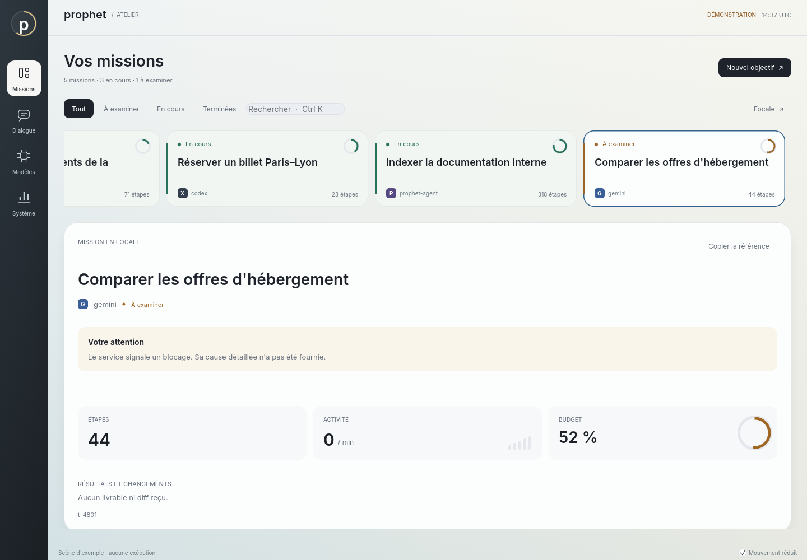

# Prophet OS

Un système d'exploitation PC conçu pour que des agents IA (Claude, GPT, Gemini, LLM locaux…) l'utilisent de façon rapide, sûre, observable et réversible, avec l'humain aux commandes.

**Objectif.** Donner aux agents une interface sémantique, des capacités limitées, des versions de fichiers réversibles, un journal d'audit et un choix de modèles, avec une supervision humaine explicite. Ces capacités sont à des stades d'intégration différents ; l'état vérifié figure ci-dessous.

**Architecture.** Linux et NixOS, services natifs Rust pour les agents, les capacités, l'isolation, les fichiers et le journal, surface de supervision native et session humaine Wayland avec SwayFX. Les agents lisent le web par le proxy de sortie et naviguent par l'arbre sémantique d'un navigateur piloté ; l'humain a son navigateur et l'application X installés par défaut.

📄 **[Plan complet](docs/PLAN.md)** : diagnostic, principes, architecture, spécification des composants, sécurité, feuille de route, équipe, métriques, risques, MVP.

🛠️ **[Plan d'exécution pour l'agent constructeur](docs/BUILD_PLAN.md)** : 14 jalons, 79 tâches avec critères d'acceptation vérifiables, à suivre dans l'ordre de [`docs/STATUS.md`](docs/STATUS.md). Instructions de travail dans [`CLAUDE.md`](CLAUDE.md), décisions dans [`docs/adr/`](docs/adr/), spécifications gelées dans [`docs/specs/`](docs/specs/).

---

## État du code

Prophet OS est **en développement**. L'ISO démarre en machine virtuelle. Une mission saisie dans
l'interface peut être planifiée, lancée avec Qwen3 et produire un fichier de travail examinable
avec les vrais services. Le [moteur de publication](docs/reports/publication-2026-09-13.md)
possède des contrôles de conflits et une reprise journalisée ; le créateur de la mission
[publie et annule](docs/reports/approbation-2026-09-13.md) ces versions depuis la CLI et
l'atelier, par agentd. L'écriture sous l'identité humaine sur l'image installée et le
confinement complet restent à intégrer.
Le parcours du bureau réussit en VM. Sur disque installé, la CI vérifie le démarrage, l'intégrité,
la session et les fichiers, puis échoue en relevant le processus bref de Claude Code sans réseau.
Le parcours installé complet et la compatibilité stricte de ChatGPT restent à valider. Les critères
de la version complète sont suivis dans
[`docs/FRONTIER.md`](docs/FRONTIER.md).

Le pilote local parle maintenant à un vrai serveur d'inférence. Une boucle avec Qwen3 sur CPU,
appel d'outil et fichier vérifié, a été exercée ; le [rapport reproductible](docs/reports/local-inference-2026-09-12.md)
précise ce que cet essai prouve et ce qu'il ne prouve pas.

L'espace natif permet de choisir ce modèle, d'écrire une demande, de recevoir sa réponse en flux,
de copier le texte et d'interrompre la génération. Il comprend aussi les tâches et décisions des
services. Les conversations restent en mémoire pendant la session ; le cycle de vie des moteurs
et l'exécution agentique complète sont encore en cours d'intégration. Voir le
[guide de l'espace natif](crates/surface/README.md).

Une mission peut maintenant [lire le web et naviguer](docs/reports/navigateur-2026-09-13.md) :
`http.fetch` passe par egress sous le jeton de la tâche, et `web.open`, `web.tree`, `web.act`
pilotent un Chromium par son arbre sémantique, sans capture d'écran, quand le service en nomme
un ; tout le trafic de ce navigateur passe lui aussi par egress, par un relais local. L'humain
voit où l'agent navigue et ce qu'il a touché, et peut y aller avec son propre navigateur. Le
bureau ouvre un navigateur à profil Prophet (Super+N) et X en fenêtre dédiée (Super+X) ; l'image
qui les contient se construit et démarre en CI, le parcours complet du bureau reste à confirmer.

Le nouvel [atelier de supervision](docs/reports/atelier-2026-09-13.md) présente une galerie de
missions et une Focale pour examiner le travail, avec recherche Ctrl+K et navigation compacte.

Une [session humaine avec plusieurs applications](docs/reports/bureau-humain-2026-09-13.md) est
intégrée dans la configuration d'image : connexion PAM, supervision, ChatGPT, Claude Code et Codex,
terminal et fichiers. Le test du bureau vérifie aussi le verrouillage et la reconnexion.
ChatGPT conserve un défaut de compatibilité bloquant ; ce bureau
expérimental ne constitue pas encore une version entièrement fonctionnelle.



Les [instruments de l'atelier](docs/reports/instruments-2026-09-13.md) : anneaux de budget,
monogrammes de pilote, bandes d'état et rail éclairé, rendus et vérifiés en rendu logiciel.

Captures, essais Wayland et limites : [rapport de l'espace natif](docs/reports/espace-natif-2026-09-12.md).

```
prophet status          # ce que la machine sait faire, et ce qu'elle ne sait pas
prophet provider ls     # pilotes disponibles et sessions d'abonnement
prophet provider models # modèles du moteur local (port 8080 par défaut)
prophet provider chat --model qwen3-0.6b "Bonjour /no_think"
prophet task ls         # missions connues du service, y compris terminées
prophet task show <id>  # plan, état et résultat conservés par agentd
prophet task diff <id>  # changements proposés, non appliqués
prophet task apply <id> # publie les versions examinées dans vos documents
prophet task undo <id>  # annule cette publication si rien n'a changé depuis
prophet log verify      # vérifier l'intégrité du journal
```

### Anciennes mesures de composants

Ces microtests ne mesurent pas l'OS installé de bout en bout et ne constituent pas une comparaison
SOTA. Ils sont conservés comme historique ; les essais réels récents sont décrits dans les rapports.

| Propriété | Mesure |
|---|---|
| Contrôle de capacité | 11,6 µs par appel, pour 200 µs visés |
| Démarrage d'une sandbox de niveau 0 | 2,6 ms |
| Ancien microtest de gel | 124 µs ; ne valide pas l'arrêt de tous les processus installés |
| Observation d'une page web | 1 929 octets, contre environ 900 Ko pour une capture d'écran |
| Suite adversariale | 20 attaques sur 20 sans conséquence |
| Démonstration multi-pilotes M8 | contrat exercé avec simulacres ; clients officiels non exécutés |

Le détail, y compris **ce qui n'est pas vérifié et pourquoi**, est dans [`docs/reports/phase0.md`](docs/reports/phase0.md).

### Vérifier sur une machine complète

Les capacités matérielles dépendent de la machine qui construit ou exécute le système. Les
tests de composants ne prouvent pas à eux seuls que chaque mécanisme est appliqué aux tâches.
Sur une machine Linux dédiée :

```
just probe-host    # dit ce qui manque, sans rien exécuter
just verify-host   # suite complète, tests matériels compris, et rapport
```

Le script ne compte jamais un test ignoré comme réussi.

### Organisation

| Crate | Rôle |
|---|---|
| `prophet-types` | jetons de capacité, manifestes, événements, sérialisation canonique |
| `prophet-ipc` | JSON-RPC sur socket Unix, identité du pair attestée par le noyau |
| `capd` | broker de capacités, politiques Cedar, approbations |
| `ledger` | journal en ajout seul, chaîné et scellé |
| `sfs` | espace de travail par tâche, diff, annulation |
| `sandboxd` | isolation graduée, du confinement à la microVM |
| `vault`, `egress` | secrets jamais vus par un modèle, unique voie réseau |
| `mcp-system` | outils système, contrôlés au même endroit pour tous |
| `agentd`, `providers` | cycle de vie des tâches, pilotes d'abonnement et boucle native |
| `sup`, `browser-bridge` | interface sémantique, navigation sans pixels |
| `memoryd` | mémoire cloisonnée par espace, épisodes dérivés du journal |
| `app-editor` | application de référence publiant SUP nativement |
| `shell`, `prophet-cli` | vues et binaire destinés à l'humain |
| `bench` | suite adversariale et mesure de coût |
