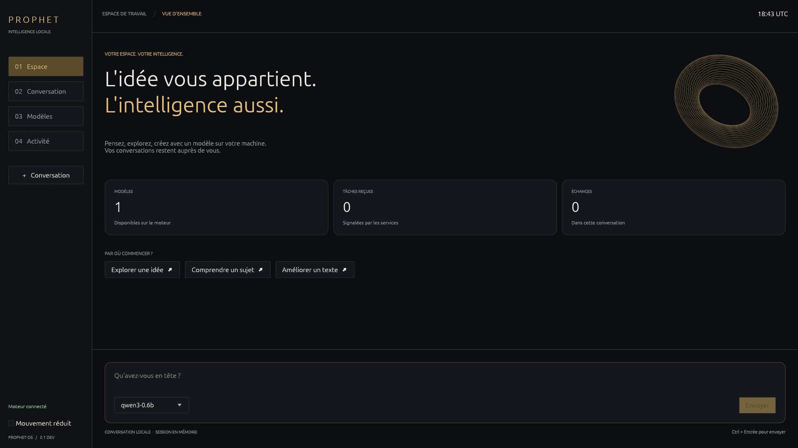

# Prophet OS

Un système d'exploitation PC conçu pour que des agents IA (Claude, GPT, Gemini, LLM locaux…) l'utilisent de façon rapide, sûre, observable et réversible, avec l'humain aux commandes.

**Pourquoi ?** Les OS actuels sont faits pour un humain avec des yeux et une souris. Un agent y travaille en aveugle : captures d'écran, clics aux coordonnées, permissions tout-ou-rien, aucun retour arrière. Prophet OS fait de l'agent un utilisateur de première classe : interface sémantique au lieu de pixels, capacités fines au lieu d'identité empruntée, snapshots et undo global, journal d'audit signé, routage vers n'importe quel modèle.

**Comment ?** Noyau Linux LTS durci et configuré sur mesure ; tout l'espace utilisateur repensé de zéro (runtime d'agents, broker de capacités, sandbox graduée, système de fichiers sémantique, protocole d'UI sémantique, routeur de modèles, mémoire, ledger).

📄 **[Plan complet](docs/PLAN.md)** : diagnostic, principes, architecture, spécification des composants, sécurité, feuille de route, équipe, métriques, risques, MVP.

🛠️ **[Plan d'exécution pour l'agent constructeur](docs/BUILD_PLAN.md)** : 14 jalons, 79 tâches avec critères d'acceptation vérifiables, à suivre dans l'ordre de [`docs/STATUS.md`](docs/STATUS.md). Instructions de travail dans [`CLAUDE.md`](CLAUDE.md), décisions dans [`docs/adr/`](docs/adr/), spécifications gelées dans [`docs/specs/`](docs/specs/).

---

## État du code

Prophet OS est **en développement**. L'ISO démarre en machine virtuelle et les composants ont
des tests automatisés, mais la chaîne complète interface → agent → outils n'est pas encore
opérationnelle. Des intégrations restent à écrire : ce ne sont pas uniquement des vérifications
matérielles manquantes. Les critères de la version complète sont suivis dans
[`docs/FRONTIER.md`](docs/FRONTIER.md).

Le pilote local parle maintenant à un vrai serveur d'inférence. Une boucle avec Qwen3 sur CPU,
appel d'outil et fichier vérifié, a été exercée ; le [rapport reproductible](docs/reports/local-inference-2026-09-12.md)
précise ce que cet essai prouve et ce qu'il ne prouve pas.

L'espace natif permet de choisir ce modèle, d'écrire une demande, de recevoir sa réponse en flux,
de copier le texte et d'interrompre la génération. Il comprend aussi les tâches et décisions des
services. Les conversations restent en mémoire pendant la session ; le cycle de vie des moteurs
et l'exécution agentique complète sont encore en cours d'intégration. Voir le
[guide de l'espace natif](crates/surface/README.md).



Captures, essais Wayland et limites : [rapport de l'espace natif](docs/reports/espace-natif-2026-09-12.md).

```
prophet status          # ce que la machine sait faire, et ce qu'elle ne sait pas
prophet provider ls     # pilotes disponibles et sessions d'abonnement
prophet provider models # modèles du moteur local (port 8080 par défaut)
prophet provider chat --model qwen3-0.6b "Bonjour /no_think"
prophet task ls         # tâches, même sans daemon en service
prophet task undo <id>  # défaire une tâche déjà validée
prophet log verify      # vérifier l'intégrité du journal
```

### Anciennes mesures de composants

Ces microtests ne mesurent pas l'OS installé de bout en bout et ne constituent pas une comparaison
SOTA. Ils sont conservés comme historique ; les essais réels récents sont décrits dans les rapports.

| Propriété | Mesure |
|---|---|
| Contrôle de capacité | 11,6 µs par appel, pour 200 µs visés |
| Démarrage d'une sandbox de niveau 0 | 2,6 ms |
| Ancien microtest de gel | 124 µs ; ne valide pas l'arrêt de tous les processus installés |
| Observation d'une page web | 1 929 octets, contre environ 900 Ko pour une capture d'écran |
| Suite adversariale | 20 attaques sur 20 sans conséquence |
| Démonstration multi-pilotes M8 | contrat exercé avec simulacres ; clients officiels non exécutés |

Le détail, y compris **ce qui n'est pas vérifié et pourquoi**, est dans [`docs/reports/phase0.md`](docs/reports/phase0.md).

### Vérifier sur une machine complète

Les capacités matérielles dépendent de la machine qui construit ou exécute le système. Les
tests de composants ne prouvent pas à eux seuls que chaque mécanisme est appliqué aux tâches.
Sur une machine Linux dédiée :

```
just probe-host    # dit ce qui manque, sans rien exécuter
just verify-host   # suite complète, tests matériels compris, et rapport
```

Le script ne compte jamais un test ignoré comme réussi.

### Organisation

| Crate | Rôle |
|---|---|
| `prophet-types` | jetons de capacité, manifestes, événements, sérialisation canonique |
| `prophet-ipc` | JSON-RPC sur socket Unix, identité du pair attestée par le noyau |
| `capd` | broker de capacités, politiques Cedar, approbations |
| `ledger` | journal en ajout seul, chaîné et scellé |
| `sfs` | espace de travail par tâche, diff, annulation |
| `sandboxd` | isolation graduée, du confinement à la microVM |
| `vault`, `egress` | secrets jamais vus par un modèle, unique voie réseau |
| `mcp-system` | outils système, contrôlés au même endroit pour tous |
| `agentd`, `providers` | cycle de vie des tâches, pilotes d'abonnement et boucle native |
| `sup`, `browser-bridge` | interface sémantique, navigation sans pixels |
| `memoryd` | mémoire cloisonnée par espace, épisodes dérivés du journal |
| `app-editor` | application de référence publiant SUP nativement |
| `shell`, `prophet-cli` | vues et binaire destinés à l'humain |
| `bench` | suite adversariale et mesure de coût |
