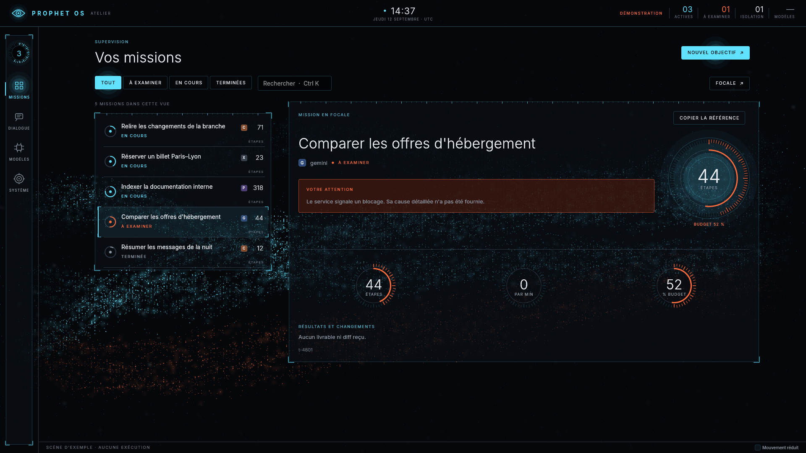

# Prophet OS

Un système d'exploitation PC conçu pour que des agents IA (Claude, GPT, Gemini, LLM locaux…) l'utilisent de façon rapide, sûre, observable et réversible, avec l'humain aux commandes.

**Objectif.** Donner aux agents une interface sémantique, des capacités limitées, des versions de fichiers réversibles, un journal d'audit et un choix de modèles, avec une supervision humaine explicite. Ces capacités sont à des stades d'intégration différents ; l'état vérifié figure ci-dessous.

**Architecture.** Linux et NixOS, services natifs Rust pour les agents, les capacités, l'isolation, les fichiers et le journal, surface de supervision native et session humaine Wayland avec SwayFX. Les agents lisent le web par le proxy de sortie et naviguent par l'arbre sémantique d'un navigateur piloté ; l'humain a son navigateur et l'application X installés par défaut.

📄 **[Plan complet](docs/PLAN.md)** : diagnostic, principes, architecture, spécification des composants, sécurité, feuille de route, équipe, métriques, risques, MVP.

🛠️ **[Plan d'exécution pour l'agent constructeur](docs/BUILD_PLAN.md)** : 14 jalons, 79 tâches avec critères d'acceptation vérifiables, à suivre dans l'ordre de [`docs/STATUS.md`](docs/STATUS.md). Instructions de travail dans [`CLAUDE.md`](CLAUDE.md), décisions dans [`docs/adr/`](docs/adr/), spécifications gelées dans [`docs/specs/`](docs/specs/).

---

## État du code

Prophet OS est **en développement**. L'ISO démarre en machine virtuelle. Une mission saisie dans
l'interface peut être planifiée, lancée avec Qwen3 et produire un fichier de travail examinable
avec les vrais services. Le [moteur de publication](docs/reports/publication-2026-09-13.md)
possède des contrôles de conflits et une reprise journalisée ; le créateur de la mission
[publie et annule](docs/reports/approbation-2026-09-13.md) ces versions depuis la CLI et
l'atelier, par agentd. L'écriture sous l'identité humaine sur l'image installée et le
confinement complet restent à intégrer.
Le parcours du bureau réussit en VM. La CI de la branche de travail du 22 septembre (`d6e686f`)
réussit l'installation sur disque et le démarrage du système installé en UEFI comme sans UEFI,
les sept services sous systemd, la mission réelle Qwen3 sous NixOS et l'ouverture de ChatGPT
sous NixOS et XWayland ; aucun PC réel n'a encore été essayé. Les critères de la version complète
sont suivis dans [`docs/FRONTIER.md`](docs/FRONTIER.md).

Le pilote local parle maintenant à un vrai serveur d'inférence. Une boucle avec Qwen3 sur CPU,
appel d'outil et fichier vérifié, a été exercée ; le [rapport reproductible](docs/reports/local-inference-2026-09-12.md)
précise ce que cet essai prouve et ce qu'il ne prouve pas.

L'espace natif permet de choisir ce modèle, d'écrire une demande, de recevoir sa réponse en flux,
de copier le texte et d'interrompre la génération. Il comprend aussi les tâches et décisions des
services. Les conversations restent en mémoire pendant la session ; le cycle de vie des moteurs
et l'exécution agentique complète sont encore en cours d'intégration. Voir le
[guide de l'espace natif](crates/surface/README.md).

Une mission peut maintenant [lire le web et naviguer](docs/reports/navigateur-2026-09-13.md) :
`http.fetch` passe par egress sous le jeton de la tâche, et `web.open`, `web.tree`, `web.act`
pilotent un Chromium par son arbre sémantique, sans capture d'écran, quand le service en nomme
un ; tout le trafic de ce navigateur passe lui aussi par egress, par un relais local. L'humain
voit où l'agent navigue et ce qu'il a touché, et peut y aller avec son propre navigateur. Le
bureau ouvre un navigateur à profil Prophet (Super+N) et X en fenêtre dédiée (Super+X) ; l'image
qui les contient se construit et démarre en CI, le parcours complet du bureau reste à confirmer.

[Jev](docs/reports/jev-2026-09-17.md), le modèle de décision de TypeSafe AI, peut désormais
router chaque mission vers le modèle génératif qui lui convient et opérer lui-même une page par
son arbre sémantique, en quelques centaines de millisecondes par décision, en rendant la main au
modèle génératif dès qu'il faut écrire. Sa clé reste dans le coffre, ses requêtes passent par le
proxy de sortie, et il est optionnel : sans lui, tout fonctionne comme avant ([ADR 0042](docs/adr/0042-jev-decideur-rapide.md)).

L'atelier de supervision suit la [direction Réacteur](docs/reports/interface-reacteur-2026-09-13.md) :
la nuit, un accent au choix, un champ dont les rubans avancent à la vitesse réelle des missions,
et rien d'affiché qui ne vienne d'un service. Sa [seconde passe](docs/reports/reacteur-seconde-passe-2026-09-22.md)
aligne les plaques au pixel, reçoit l'objectif dès l'écran vide, se pilote entièrement au clavier
(Ctrl K, Ctrl N, Ctrl 1 à 4, Échap), dit le dernier geste de l'agent relu dans le journal, et
ralentit son champ quand personne n'agit.

Côté agents, une mission lit son propre état et son budget restant (`task.status`) et ses
changements (`task.diff`) ; elle lit un gros fichier par morceaux (`fs.read` avec `offset`) et
cherche des lignes plutôt que des fichiers (`fs.search`) ; un historique plus long que la
fenêtre du modèle local est resserré à sa mesure au lieu de faire échouer la mission, en
ménageant le cache du moteur ; le catalogue des poids dit l'architecture, la quantification et
la fenêtre de chaque modèle, et celle que le moteur sert vraiment (`prophet model ls`) ; un
poids du catalogue du système se télécharge par le proxy de sortie, vérifié avant d'être posé,
et reprend où il s'était arrêté (`prophet model pull`) ; chaque poids dit, avant d'être
téléchargé ou chargé, la mémoire qu'il demandera à la fenêtre du moteur et ce que son gabarit
sait faire (outils, réflexion) — un agent reçoit le poids recommandé (`model.list`), et un
modèle qui ferait paginer la machine n'est ni servi ni confié à une mission ; le moteur charge
ses poids sans projection, ce qui a fait baisser sa mémoire résidente d'un tiers (ADR 0047) ;
une mission échouée se relance par son contexte (« Relancer », `prophet task retry`). Un agent
corrige un passage sans réécrire tout le fichier (`fs.edit`) ; `fs.read` compte les lignes pour
lui ; un chemin refusé lui est rendu avec l'endroit où il peut agir, au lieu d'arrêter la
mission (la révocation, elle, l'arrête) ; et s'il conclut sans avoir écrit le fichier que
l'objectif nomme, le service le lui rappelle (ADR 0049 à 0051).

Le [banc M13](docs/reports/banc-m13-2026-09-23.md) joue la suite de tâches avec le modèle de
l'image, par Prophet et par une boucle nue qui appelle les mêmes outils sans capd ni journal :
au huitième passage, **21 réussites sur 45 par Prophet contre 12** avec Qwen3 1.7B, et **10 sur
15 contre 8** avec Qwen3 4B ; ses services coûtent 0,3 à 0,5 s de processeur et 47 Mo par
mission, et ses missions, qui continuent là où la boucle nue conclut, dépensent davantage de
calcul du modèle. Il le rejoue à chaque poussée et publie chaque exécution : les
outils appelés, la réponse du modèle, ce qui a été rappelé.

Le code d'un agent tourne dans une microVM Firecracker **rendue en une dizaine de
millisecondes** : sandboxd en tient deux prêtes, restaurées d'un instantané, et chaque exécution
reçoit une machine neuve, sans réseau ([ADR 0045](docs/adr/0045-la-reserve-de-microvm-par-instantane.md),
médiane de 8,9 à 10,9 ms mesurée sur le coureur KVM de la CI, pour un objectif de 150 ms). Au
niveau 0, Landlock borne désormais ce qu'un outil confiné peut écrire et exécuter. Un processus
de la session humaine n'obtient de droit qu'à travers une mission qu'agentd planifie et
journalise, n'écrit pas au journal, et ne peut pas se faire passer pour un daemon
([ADR 0044](docs/adr/0044-les-methodes-reservees-par-classe-de-pair.md)).

Une [session humaine avec plusieurs applications](docs/reports/bureau-humain-2026-09-13.md) est
intégrée dans la configuration d'image : connexion PAM, supervision, ChatGPT, Claude Code et Codex,
terminal et fichiers. Le test du bureau vérifie aussi le verrouillage et la reconnexion.
Aucun compte ChatGPT, Claude ou Codex n'y a encore été connecté ; ce bureau ne constitue pas
encore une version entièrement fonctionnelle.



Captures régénérées par `just captures`, en rendu logiciel ; la fluidité et la consommation sur
une carte graphique réelle restent à mesurer avec `prophet-surface --mesure` et `--repos`.

Captures, essais Wayland et limites : [rapport de l'espace natif](docs/reports/espace-natif-2026-09-12.md).

```
prophet status          # ce que la machine sait faire, et ce qu'elle ne sait pas
prophet provider ls     # pilotes disponibles et sessions d'abonnement
prophet provider models # modèles du moteur local (port 8080 par défaut)
prophet model ls        # poids installés, mémoire demandée, outils, et la fenêtre servie
prophet model catalog   # poids que le système sait télécharger, avec leur empreinte
prophet model pull qwen3-0.6b-q8   # par egress, vérifié (SHA-256, GGUF) avant d'être posé
prophet model serve qwen3-0.6b-q8  # le fait charger, s'il tient en mémoire
prophet provider chat --model qwen3-0.6b "Bonjour /no_think"
prophet task ls         # missions connues du service, y compris terminées
prophet task show <id>  # plan, état et résultat conservés par agentd
prophet task diff <id>  # changements proposés, non appliqués
prophet task retry <id> # prépare à nouveau une mission échouée, par son contexte
prophet task apply <id> # publie les versions examinées dans vos documents
prophet task undo <id>  # annule cette publication si rien n'a changé depuis
prophet log verify      # vérifier l'intégrité du journal
```

### Anciennes mesures de composants

Ces microtests ne mesurent pas l'OS installé de bout en bout et ne constituent pas une comparaison
SOTA. Ils sont conservés comme historique ; les essais réels récents sont décrits dans les rapports.

| Propriété | Mesure |
|---|---|
| Contrôle de capacité | 11,6 µs par appel, pour 200 µs visés |
| Démarrage d'une sandbox de niveau 0 | 2,6 ms |
| Ancien microtest de gel | 124 µs ; ne valide pas l'arrêt de tous les processus installés |
| Observation d'une page web | 1 929 octets, contre environ 900 Ko pour une capture d'écran |
| Suite adversariale | 20 attaques sur 20 sans conséquence |
| Démonstration multi-pilotes M8 | contrat exercé avec simulacres ; clients officiels non exécutés |

Le détail, y compris **ce qui n'est pas vérifié et pourquoi**, est dans [`docs/reports/phase0.md`](docs/reports/phase0.md).

### Vérifier sur une machine complète

Les capacités matérielles dépendent de la machine qui construit ou exécute le système. Les
tests de composants ne prouvent pas à eux seuls que chaque mécanisme est appliqué aux tâches.
Sur une machine Linux dédiée :

```
just probe-host    # dit ce qui manque, sans rien exécuter
just verify-host   # suite complète, tests matériels compris, et rapport
```

Le script ne compte jamais un test ignoré comme réussi.

### Organisation

| Crate | Rôle |
|---|---|
| `prophet-types` | jetons de capacité, manifestes, événements, sérialisation canonique |
| `prophet-ipc` | JSON-RPC sur socket Unix, identité du pair attestée par le noyau |
| `capd` | broker de capacités, politiques Cedar, approbations |
| `ledger` | journal en ajout seul, chaîné et scellé |
| `sfs` | espace de travail par tâche, diff, annulation |
| `sandboxd` | isolation graduée, du confinement à la microVM |
| `vault`, `egress` | secrets jamais vus par un modèle, unique voie réseau |
| `mcp-system` | outils système, contrôlés au même endroit pour tous |
| `agentd`, `providers` | cycle de vie des tâches, pilotes d'abonnement et boucle native |
| `sup`, `browser-bridge` | interface sémantique, navigation sans pixels |
| `memoryd` | mémoire cloisonnée par espace, épisodes dérivés du journal |
| `app-editor` | application de référence publiant SUP nativement |
| `shell`, `prophet-cli` | vues et binaire destinés à l'humain |
| `surface` | atelier natif de supervision (Wayland, wgpu), direction Réacteur |
| `pilotd`, `supd` | dans la session humaine : lanceur des clients officiels, accessibilité des applications |
| `voice` | parole locale : transcription par whisper.cpp, voix par Piper |
| `prophet-daemon` | ce que les daemons font de la même façon : socket, état, clés, classe des pairs |
| `bench` | suite adversariale et mesure de coût |
