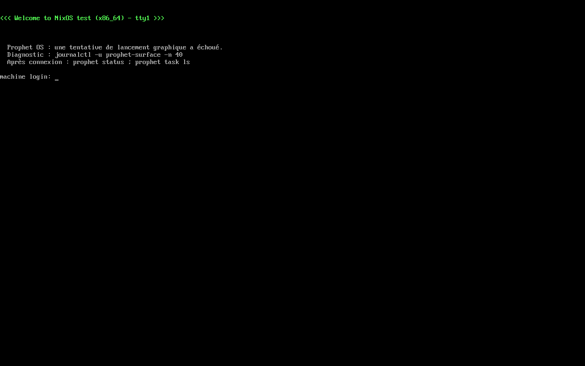
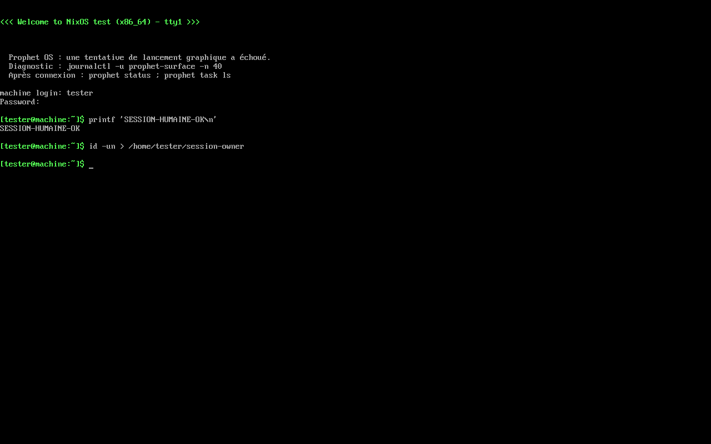

# Accès humain et secours — 13 septembre 2026

Deux échecs de l'image `d20ef74` sont identifiés et corrigés après `a6b831c`.

## Consultation des missions

Le [travail des services](https://github.com/speed25200-cyber/Prophet_OS/actions/runs/34739361939/job/103676307143)
échouait sur la liste des missions sous le compte humain. L'IPC répondait ; la lecture suivante
du répertoire SFS privé à agentd provoquait `Permission denied`. La CLI conserve désormais la
liste du service. Le détail et le diff consultent son inspection, sans ouvrir les captures.

Deux régressions de la CLI ont échoué avant correction puis réussi. Elles invoquent le vrai
binaire contre un service de test, avec un chemin de captures volontairement illisible même
sous root. Elles vérifient la liste vide et remplie, le détail, le diff et leurs formats JSON.
Elles ne remplacent pas l'essai des véritables UID et services en VM, renforcé séparément.

```sh
nix develop --command cargo test -p prophet-cli --test task_service
```

Vérification complète : `nix develop --command just check` réussit avec **633 tests,
aucun échec et 29 ignorés**, format, clippy, construction des binaires et contrôles du dépôt.

## Connexion de secours

Le [travail du système installé](https://github.com/speed25200-cyber/Prophet_OS/actions/runs/34739361939/job/103676307247)
attendait une invite disparue de l'écran sous les avis de panne graphique. Le diagnostic passe
maintenant par les fichiers d'annonce de getty et son rechargement, sans écriture concurrente
sur tty1. Le texte annonce une tentative échouée et oriente vers le journal ; il ne prétend
plus que tous les autres composants fonctionnent.

```sh
nix build .#checks.x86_64-linux.surface-rescue --print-build-logs
```

**VM KVM réussie en 34,98 secondes de script**, démarrage compris. L'avis tardif et `login:`
restent visibles ensemble. Un nouvel avis pendant le mot de passe conserve le processus de
connexion, puis le mot de passe ouvre la session. Un dernier avis conserve cette session,
qui écrit un fichier dont le contenu confirme l'utilisateur `tester`. Les ACL temporaires
de `/dev/kvm` pour les constructeurs Nix ont été restaurées après l'essai local.





Le programme graphique est remplacé par un échec contrôlé dans ce test court. La VM ne
construit ni la surface ni les daemons. La CI exerce ensuite le test installé complet, avec
le vrai paquet, les services et systemd-boot. Ce résultat complet reste à établir pour la
nouvelle révision ; les captures ci-dessus ne le valident pas.

## Limites

ChatGPT reste en échec strict sur Fontconfig dans un renderer secondaire, hors de l'image.
Les traces antérieures montrent que le processus principal charge sa configuration de
polices ; elles ne donnent pas encore de correction sûre au défaut secondaire. Aucun
changement de client ni désactivation de sandbox n'est appliqué ici. Le bureau humain,
les sessions authentifiées des clients officiels, l'application/undo des changements et
la qualité graphique attendue restent à livrer. Aucun critère complet de FRONTIER n'est coché.
