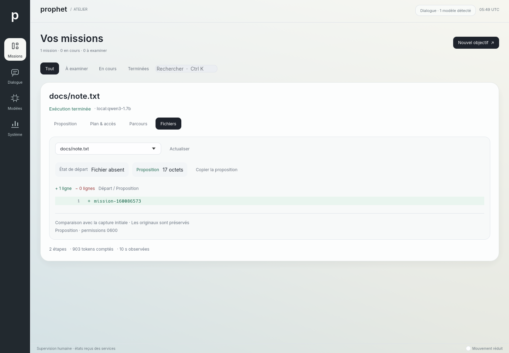

# Atelier de supervision — 13 septembre 2026

Révision de travail après `d20ef74`, dans le commit portant ce rapport.

**Validation finale `just check` dans Nix : 631 tests réussis, aucun échec, 29 ignorés**,
avec format, clippy, construction des programmes et contrôles du dépôt.
**Les 19 tests graphiques explicites réussissent** : neuf parcours du bureau, quatre parcours
de mission avec vrais services et moteur contrôlé, six tests du renderer historique.
La série séparée avec Qwen3-1.7B réussit **deux essais sur trois**, avec un refus de capture
avant l'inférence lors du premier essai, détaillé ci-dessous.

## Parcours

Le bureau utilise une navigation graphite, un fond minéral et une surface principale consacrée
au travail sélectionné. Une galerie permet de passer entre plusieurs missions ; **Focale**
libère cette place pour examiner le plan, la proposition ou les fichiers. Une mission seule
dispose directement de l'inspecteur. À petite largeur, la navigation descend dans une barre
et le contexte remplace la liste après sélection.

**Ctrl+K** ouvre la recherche sur les titres, références et pilotes. Les filtres et la recherche
conservent une sélection qui appartient au résultat affiché. Un plan nouvellement préparé
efface la recherche précédente et s'ouvre en Focale. Le lancement reste un clic distinct.

La galerie horizontale compose uniquement les objets voisins de la zone visible. Le fond reste
statique au repos, y compris lorsque la préférence de mouvement réduit est désactivée. Les
lectures des services, les commandes et la comparaison des fichiers conservent leurs contrôleurs.

## Captures natives

Les scènes de démonstration ci-dessous sont identifiées dans le binaire. Elles ne prouvent pas
des sessions actives de Claude, Codex ou Gemini.


| Vue | Capture |
|---|---|
| Accueil sans missions reçues | [1440 × 1000](../images/atelier-vide-1440.png) |
| Décision de démonstration ouverte | [1440 × 1000](../images/atelier-decision-1440.png) |
| Navigation compacte de démonstration | [640 × 900](../images/atelier-compact-640.png) |
| Modèle indisponible | [1440 × 1000](../images/atelier-modeles-1440.png) |
| Dialogue sans connexion | [1440 × 1000](../images/atelier-dialogue-1440.png) |
| Focale, scène contrôlée de deux missions | [1440 × 1000](../images/atelier-focale-1440.png) |
| Recherche parmi mille missions contrôlées | [1440 × 1000](../images/atelier-recherche-1440.png) |
| Comparaison, vrais services et moteur contrôlé | [1440](../images/atelier-fichier-1440.png), [1280](../images/atelier-fichier-1280.png), [640](../images/atelier-fichier-640.png) |
| Plan et fichier de l'essai Qwen3 réel nº 3 | [Plan](../images/atelier-reel-plan-1440.png), [Fichier](../images/atelier-reel-fichier-1440.png) |



## Régressions exercées

Le test de Focale a d'abord échoué sur l'ancien bureau, où le contrôle n'existait pas.
Le premier test de recherche a révélé une dépendance incorrecte à l'état global des touches
modificatrices ; le raccourci consomme désormais l'événement Ctrl+K avant de créer le champ.

Les captures ont aussi révélé un mélange incorrect des transparences d'egui. Le test GPU
reproduit le défaut : du blanc à moitié transparent sur du blanc rendait un gris de valeur
220. Le bureau utilise désormais une vue `Unorm` compatible, pour mélanger les couleurs dans
l'espace attendu par egui ; le renderer historique conserve sa vue sRGB. La correction porte
sur le rendu lui-même. Les captures PNG ne sont pas retouchées.

La première composition avec galerie coupait le bouton de lancement d'une mission seule.
L'inspecteur reçoit maintenant directement cet espace. La conservation des missions annulées
ou échouées est vérifiée en copiant leur référence depuis l'inspecteur et en contrôlant l'état
du service, car leur carte n'est plus dessinée quand elles sont seules.

Les tests contrôlent aussi les quatre destinations et tous les filtres aux trois tailles,
l'examen préalable à une décision, la sélection après filtrage et la préparation après une
recherche sans résultat. Les parcours de mission utilisent les vrais agentd, capd et ledger,
avec un moteur HTTP contrôlé ; les essais de modèle réel restent distincts.

Une première suite complète a rencontré trois délais `Page.enable` dans le pont navigateur.
Les quatre tests de ce fichier passent ensuite sans modification du pont, en 2,63 secondes.
Un essai graphique a aussi dépassé le délai de dix secondes avant la création du socket
d'agentd. Ces incidents de démarrage restent documentés ; aucun délai ni contrôle fonctionnel
n'a été assoupli pour les masquer.

## Mesure de la galerie

À 1440 × 1000, le test de mille missions mesure 60 compositions et soumissions successives,
après trois images de préparation : **médiane 8,592 ms, p95 13,785 ms** dans la suite finale.
Il vérifie qu'une mission éloignée n'est pas composée, puis la retrouve par Ctrl+K et copie
sa référence exacte. L'environnement est WSL Ubuntu 24.04, rendu Vulkan llvmpipe, build debug.
La durée s'arrête à la soumission : elle n'attend ni la fin du GPU ni la présentation à l'écran.
Elle ne constitue donc ni une mesure de FPS ni une charge de mille agents réels.

## Modèle réel

Le paquet corrigé `/nix/store/828hffb09kkgrb27f2pm11k1kc7r7r0m-llama-cpp-0.4.0` sert
Qwen3-1.7B-Q8_0 sur CPU. Les poids ont l'empreinte SHA-256
`061b54daade076b5d3362dac252678d17da8c68f07560be70818cace6590cb1a` ; leur provenance et les
paramètres figurent dans le [rapport du moteur](grammaire-locale-2026-09-13.md).

| Essai | Résultat | Lancement → aperçu vérifié | Images pendant l'exécution |
|---|---|---:|---:|
| 1 | Refus de capture SFS avant l'inférence | — | — |
| 2 | Contenu exact `mission-2805525680` | 16,372 s | 126 |
| 3 | Contenu exact `mission-160086573` | 12,154 s | 90 |

Le premier essai rend `capture SFS : chemin, type ou droit refusé`. Le contrôle est situé avant
l'appel du modèle ; le message du test le qualifie trop largement d'« échec du modèle ».
La cause précise n'est pas établie : ce refus générique peut aussi couvrir une erreur de
transport du contrôle de droits. Aucun refus n'est assoupli et aucune autorisation n'est
contournée. Les deux autres essais de la même série réussissent sans changement de code.

Les commandes durent respectivement 133,817 / 21,551 / 16,625 secondes ; la première comprend
la compilation. Chaque succès vérifie l'intention, le lancement explicite, les tokens comptés,
le contenu exact du fichier de travail et son aperçu, avec les originaux intacts. Les images
composées pendant l'inférence ne mesurent pas une fréquence interactive, car le test impose
des pauses. La série reste **partiellement en échec** ; elle n'est pas remplacée par une série
sélectionnée pour ses succès. Le serveur est arrêté à la fin par le vérificateur.

## Reproduction

```sh
nix develop --command just check
nix build .#local-engine-vm --print-build-logs
VK_DRIVER_FILES=/chemin/vers/lvp_icd.x86_64.json \
PROPHET_CAPTURE_DIR=/chemin/vers/captures \
  nix develop --command cargo test -p surface -- --ignored --test-threads=1 --nocapture
nix develop --command cargo run -p surface --bin prophet-surface -- \
  --capture atelier.png --demonstration --largeur 1440 --hauteur 1000
VK_DRIVER_FILES=/chemin/vers/lvp_icd.x86_64.json \
  nix develop --command python3 tools/verifier-moteur-local.py \
    --llama-server /chemin/vers/llama-server --weights /chemin/vers/Qwen3-1.7B-Q8_0.gguf \
    --model qwen3-1.7b --output /nouveau/dossier --repetitions 3 --surface
```

## Exigences ouvertes

Cette direction visuelle doit encore être appréciée par l'utilisateur. Les mesures sur un
rastériseur logiciel ne qualifient pas la fluidité d'une session installée. La liste compacte
n'est pas virtualisée ; filtrer et copier la scène restent proportionnels à sa taille.
Le parcours est encore dépourvu d'application approuvée et d'undo des propositions. Le bureau
humain avec plusieurs applications, les sessions authentifiées, l'inférence GPU, les familles
de modèles variées et la comparaison SOTA restent à construire ou à vérifier.

La [CI de `d20ef74`](https://github.com/speed25200-cyber/Prophet_OS/actions/runs/34739364100)
réussit composants, rendu, isolation, protocole et mission avec modèle réel sous NixOS.
Dans cette VM, le compte `pilot` prépare et lance une écriture exacte ; l'aperçu vient des
versions enregistrées et reste identique après redémarrage d'agentd. La lecture sous l'UID 0
est refusée avant et après ce redémarrage. Le modèle ne lit pas l'état privé d'agentd, et agentd
ne lit pas un fichier privé du propriétaire en dehors du contexte documentaire partagé.
L'original n'est pas créé et l'arrêt du service rend son endpoint indisponible.
Le script de cette VM se termine en 96,94 secondes, démarrage compris ; ce temps n'est pas
la latence du modèle. Le travail ChatGPT ouvre et ferme
sa fenêtre sous l'UID ordinaire puis échoue encore au contrôle Fontconfig. Aucune session
authentifiée n'est validée. Aucun critère complet de FRONTIER n'est coché pour cette refonte.
