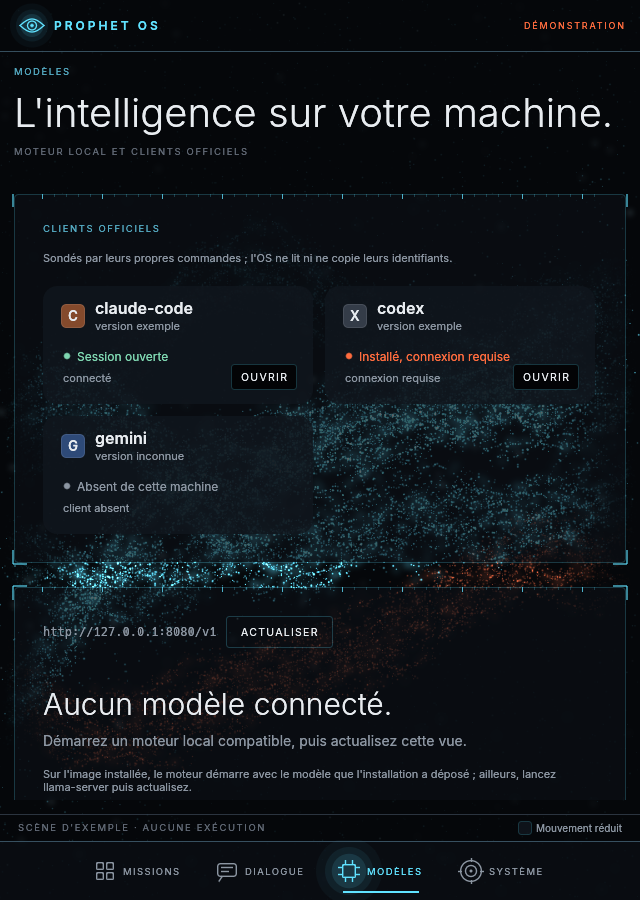
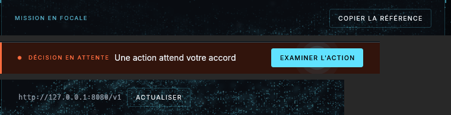
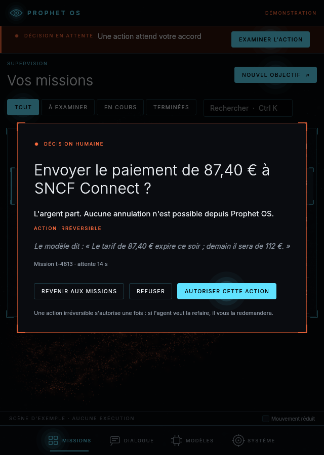
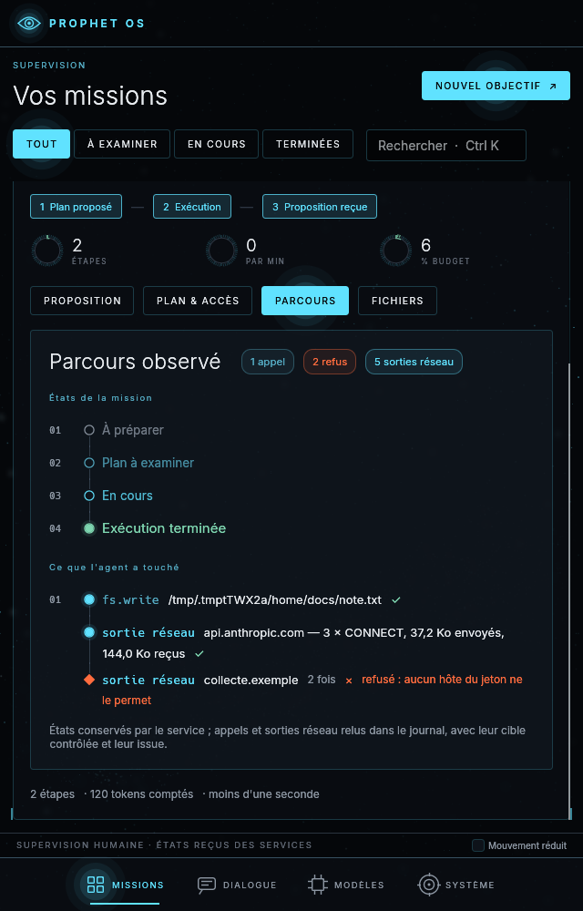
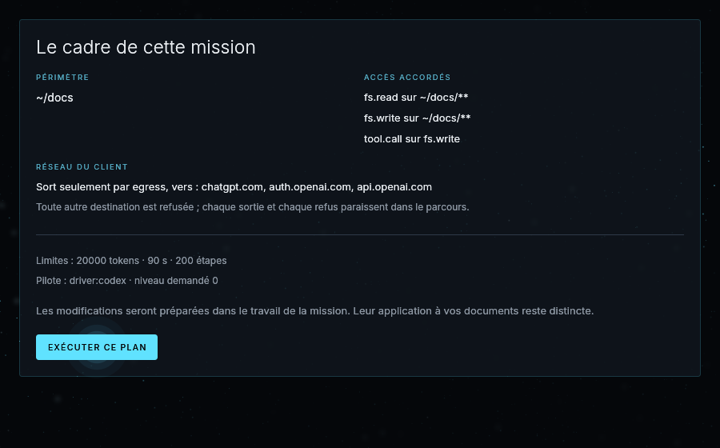
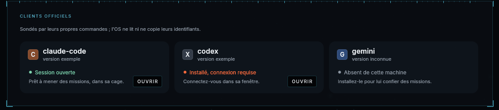
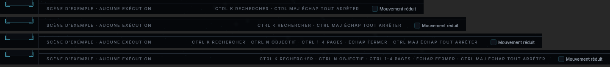
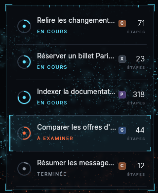

# Audit visuel et fluidité de la surface — 23 septembre 2026

Relecture complète de `prophet-surface` : les quatre pages (Missions, Dialogue, Modèles, Système),
la décision humaine et son examen, l'espace de mission branché sur les vrais services (proposition,
parcours, fichiers, direct), en 640, 1100, 1280, 1440, 1920, 2560 × 1440 et 3840 × 2160 ; puis
mesure du temps par image et de la consommation au repos, en release. Environnement : llvmpipe
(LLVM 20.1.2, Vulkan), quatre cœurs, pas de carte graphique — ce que voit une machine virtuelle
sans GPU. Les captures viennent de `prophet-surface --capture` (scène d'exemple, champ complet)
et des parcours `crates/surface/tests/{bureau,missions}.rs` (`PROPHET_CAPTURE_DIR`).

## Défauts relevés et corrigés

| Défaut | Où | Correction | Commit |
|---|---|---|---|
| La surface tombait en 2560 × 1440 et plus : wgpu plafonnait les textures à 2 048 points | toute fenêtre ou capture sur grand écran | limites du périphérique réel (`using_resolution`), cible bornée à ce qu'il accepte ; parcours `les_grands_ecrans_se_dessinent_en_1440p_et_en_4k` | `9e03dc9` |
| « Autoriser pour toute la mission » proposé pour un paiement irréversible | décision humaine | ADR 0054 : une action irréversible s'autorise une fois, dans capd et dans la surface | `9e03dc9` |
| En 640 points, les trois cartes des clients officiels restaient côte à côte ; « Ouvrir » recouvrait « connexion requise » | Modèles | trois, deux ou une colonne selon la largeur | `2c5e98c` |
| Libellés six à huit points au-dessus du milieu des boutons voisins | en-tête de mission, changements préparés, « Sur le web », bandeau de décision, « Mission en focale », adresse du moteur, accueil vide, dictée | `hud::rangee` : la rangée part de la hauteur d'un bouton (32 points) au lieu de 20 | `7894c9f`, `f4cc89f` |
| En 640 points, le cadre de la décision touchait presque les bords (5 points) | décision humaine | largeur bornée pour garder 16 points de gouttière | `f4cc89f` |
| 24 septembre — en 640 points, la suite d'un geste qui passait à la ligne repartait sous le rail de la frise | Parcours d'une mission (sorties réseau, cibles longues) | le texte s'enroule dans sa colonne ; nœud et numéro sur sa première ligne | `b3f94fc` |
| 24 septembre — « Mouvement réduit » laissait le défilement animé, et le décocher ne rendait pas les transitions | toute la surface | le réglage s'applique au changement, défilement animé compris | `9a0b998` |
| 24 septembre — la carte d'un client répétait son état (« connexion requise » deux fois) et disait « connexion requise » pour une sonde incertaine ; le conseil ajouté passait sous « Ouvrir » | Modèles | état exact, conseil enroulé à côté du bouton | `8627cb3` |
| 24 septembre — sous ~1 300 points, les raccourcis de la barre d'état passaient sur son texte de gauche | toute la surface | la version qui tient, mesurée : complète, réduite, ou rien | `a656a58` |
| 24 septembre — à 1100 points, les intitulés de la liste coupés au mot ne disaient plus rien (« Indexer la … ») | Missions | coupe au caractère (« Indexer la documentat… »), intitulé entier au survol | `3decc50` |

## Ce qui a été vérifié sans défaut

- **Missions** : liste et Focale en 1280 ; en 640, la liste seule, puis l'espace de mission avec
  retour aux missions ; en 2560, liste et Focale côte à côte, titres entiers.
- **Espace de mission branché** (vrais services) : phases, instruments, onglets Proposition,
  Plan et accès, Parcours (frise des états et de ce que l'agent a touché, refus et rappels à leur
  place), Fichiers, examen d'une version ; en 640, 1280, 1440 et 1920.
- **Dialogue** : départs proposés à un dialogue vide, sélecteur de modèle, en 640 et 1280.
- **Système** : trois niveaux d'isolation, ce qui manque au niveau 2, inventaire de la machine.
- **Accents** (arc, or, nacre, plasma, jade) et **mouvement réduit** : l'accent teint le champ,
  les boutons actifs et les fils ; l'orange d'alerte reste le même dans les cinq ; sous mouvement
  réduit, le champ est figé et la case cochée.
- Les parcours de rendu passent tous : 25 du bureau, 5 de missions avec vrais services, 6 de rendu.

Restent tels quels, par choix : sans service branché, la Focale de la scène d'exemple dit « Sa
cause détaillée n'a pas été fournie » pour la mission à examiner — la scène ne porte pas de
cause, et l'interface ne l'invente pas ; branchée, elle montre le parcours réel. En 2560 × 1440,
la scène d'exemple laisse le bas de l'écran au champ : cinq missions n'en remplissent pas plus.

## Fluidité, en release

`prophet-surface --mesure 120 --demonstration --champ-complet` (35 800 particules par image) :

| Page, taille | Image (médiane / p95) | Dont processeur avant l'attente du GPU |
|---|---|---|
| Missions, 1280 × 800 | 23,8 / 27,0 ms | 0,55 / 0,64 ms |
| Missions, 1920 × 1080 | 24,9 / 28,8 ms | 0,58 / 0,71 ms |
| Dialogue, 1920 × 1080 | 22,7 / 27,0 ms | 0,45 / 0,55 ms |
| Modèles, 1920 × 1080 | 24,6 / 30,7 ms | 0,59 / 0,74 ms |
| Système, 1920 × 1080 | 24,5 / 28,1 ms | 0,56 / 0,65 ms |
| Missions, 2560 × 1440 | 26,0 / 29,3 ms | 0,61 / 0,72 ms |
| Missions, 1920 × 1080, champ allégé (défaut logiciel, 12 000 particules) | 12,9 / 15,8 ms | — |

Le travail propre de l'interface (composition, tessellation, soumission) reste **sous 0,75 ms**
à toutes les tailles : c'est le plancher qu'une carte graphique laissera, loin des 8,3 ms d'un
écran à 120 Hz. Le reste est le tracé logiciel des particules ; il dépend à peine de la
résolution (23,8 ms pour 1 Mpx, 26,0 pour 3,7 Mpx) et suit leur nombre. Le champ allégé, que
reçoit par défaut un rastériseur logiciel, tient 77 images/s. Mémoire résidente : 153 à 165 Mio.

**Contre-mesure du 24 septembre**, après l'accueil « Ce que vos agents trouvent ici », l'en-tête
en verre, la fenêtre du code d'approbation et le panneau des conflits : même commande, Missions
en 1920 × 1080, 200 images, trois passages sur une même machine à quatre cœurs (llvmpipe). Le
commit de cet audit (`73f2031`) y donne 0,68 à 0,69 ms de processeur (médiane), `0440bb0` 0,64
à 0,68 ms : **pas de régression** ; l'écart avec les 0,58 ms du tableau vient de la machine.
Images complètes : 26,2 à 27,3 ms (médiane) en 1920 × 1080 et 2560 × 1440, mémoire résidente
158 à 167 Mio.

## Consommation au repos

`prophet-surface --repos 150 --demonstration` (1920 × 1080, trois missions actives, champ
allégé), sans geste de l'humain :

| Phase | Images/s | Processeur |
|---|---|---|
| 0–30 s, pleine cadence | 32,8 | 112,7 % d'un cœur |
| 30–120 s, cadence ralentie (ADR 0043) | 10,2 | 37,1 % d'un cœur |
| 120–150 s, veille du champ (ADR 0055) | 0,0 (une image) | **0,2 % d'un cœur** |
| Sans mission active, ou sous mouvement réduit | 0,3 | 1,5 à 1,8 % d'un cœur |

Avant l'ADR 0055, la cadence ralentie durait indéfiniment : 37 % d'un cœur pris au moteur local,
qui tourne sur le même processeur quand la machine n'a pas de carte. Le champ se fige désormais
après deux minutes sans geste, là où il est, et repart de là au premier geste ; les étapes, le
budget et les décisions continuent de s'afficher à chaque changement d'état.

## Ce qui reste à mesurer

Tout ce qui précède est mesuré sur un rastériseur logiciel. Le temps par image, la cadence et
la consommation sur une vraie carte graphique restent à relever avec les mêmes commandes
(`--mesure`, `--repos`) sur la machine à qualifier (`needs_gpu`, FRONTIER : interface).
