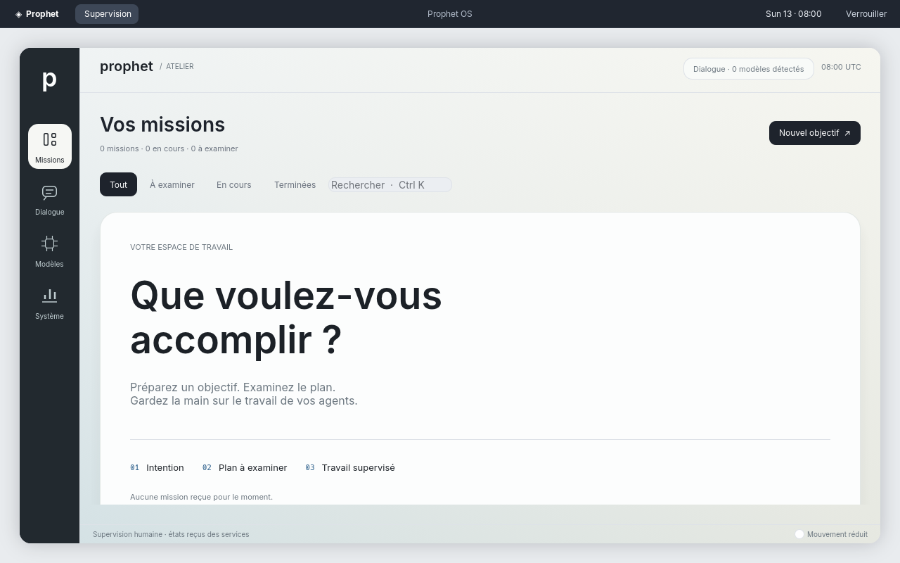
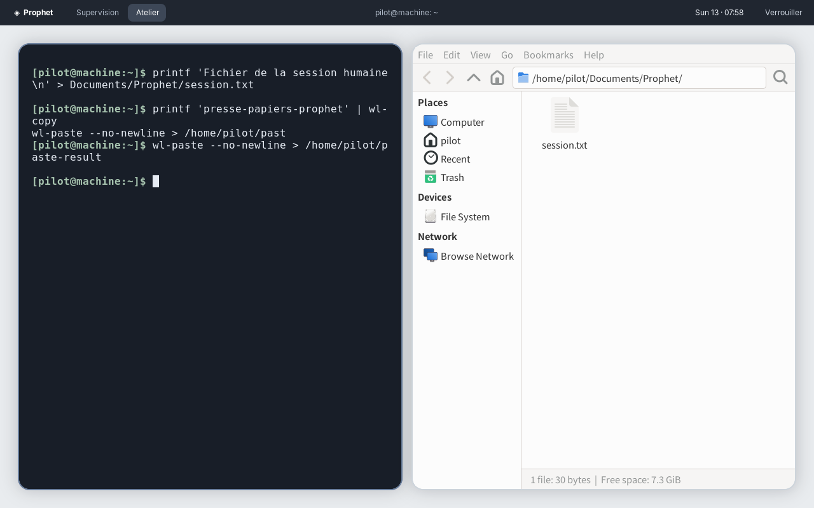
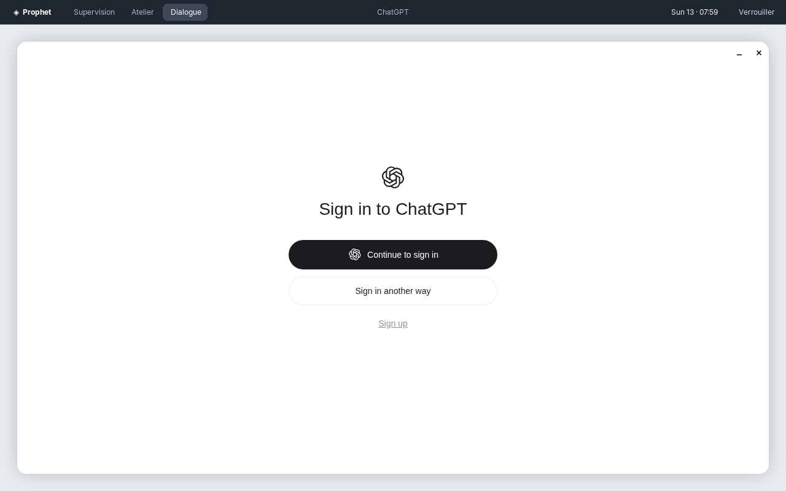

# Bureau humain — 13 septembre 2026

Révision de travail après `ddd375b`. Le parcours complet `desktop-session` réussit en VM KVM.
L'image du parcours installé est construite, mais son démarrage local échoue dans KVM/SMM
avant les services. Ce jalon ne rend pas l'OS complet.

## Résultat du parcours

Le script `desktop-session` réussit en **188,07 s**, démarrage inclus : connexion PAM,
supervision Wayland sous UID 1000, sept services, terminal et fichier réel, Thunar,
presse-papiers Wayland, processus officiels, diagnostics de connexion, interfaces de portails
et de trousseau, refus d'un mauvais mot de passe, reprise des mêmes fenêtres, annulation
de la déconnexion, déconnexion effective et nouvelle supervision après reconnexion.

La VM possède 4 Gio de mémoire et deux cœurs, avec QEMU/KVM, SwayFX 0.6 et un écran
de 1280 × 800. Le compositeur utilise pixman et la surface llvmpipe/Vulkan. Ces réglages
de test ne désactivent pas l'accélération de la configuration livrée. La durée inclut les
attentes et la reconnaissance de texte ; elle ne mesure pas une latence d'utilisation.

Sortie reproductible du test réussi :
`/nix/store/ckwkj2vpxnhja8bhvyinwwk7s7pidrj2-vm-test-run-prophet-desktop-session`.

## Captures du parcours réussi

Ces sept captures de 1280 × 800 proviennent directement du test `desktop-session`, sans retouche.
La session est vierge, sans poids de modèle et sans compte cloud connecté.







Autres états vérifiés : [écran de connexion](../images/bureau-humain-connexion.png),
[lanceur clavier](../images/bureau-humain-lanceur.png),
[Codex en attente de connexion](../images/bureau-humain-codex.png),
[diagnostic réseau de Claude Code conservé dans son terminal](../images/bureau-humain-claude.png).

## Ce qui change

La configuration installée comprend une session Wayland du propriétaire avec connexion PAM,
supervision, ChatGPT, Claude Code, Codex, terminal, fichiers, navigateur, portails et trousseau.
Le lanceur et la déconnexion sont accessibles au clavier. Le verrouillage demande le mot de
passe de la session. La supervision possède une identité de fenêtre stable et fonctionne sous
l'UID humain, distinct des sept comptes de services. Voir l'[ADR 0021](../adr/0021-session-humaine-wayland.md).

Le test installé partage désormais le parcours du bureau. Il exige une vraie connexion et
des fenêtres, alors que le test précédent acceptait une tentative graphique suivie d'un échec.
Le contrôle du secours historique est conservé dans `surface-rescue`. Les captures du nouveau
test doivent être publiées par le travail « Le système installé démarre » de la CI.

ChatGPT entre dans l'image comme application expérimentale ; son test strict reste inchangé
et en échec. Les clients interactifs ne sont pas annoncés comme pilotes d'agents prêts.

## Vérification de la révision précédente

La CI de `ddd375b`, relue le 13 septembre, confirme les correctifs d'accès humain :

- [Sept services](https://github.com/speed25200-cyber/Prophet_OS/actions/runs/34742587406/job/103684726538) :
  réussite, 43,13 s de script VM. La liste et le détail passent sous le compte du propriétaire
  alors que la lecture directe des captures reste refusée. Le diff absent conserve son erreur explicite.
- [Démarrage installé](https://github.com/speed25200-cyber/Prophet_OS/actions/runs/34742587406/job/103684726624) :
  secours dédié réussi en 31,14 s, puis ancien parcours installé réussi en 52,10 s. La connexion
  console et les services passent ; ce test ne garantissait pas un bureau graphique utilisable.
- [Mission avec modèle réel](https://github.com/speed25200-cyber/Prophet_OS/actions/runs/34742587413/job/103684698804) :
  réussite en 73,87 s de script, avec modèle sous compte distinct, mission du propriétaire et arrêt du moteur.
- [ChatGPT](https://github.com/speed25200-cyber/Prophet_OS/actions/runs/34742587413/job/103684698889) :
  écran de connexion, plugins et fermeture exercés, puis échec sur l'erreur Fontconfig secondaire.

Ces résultats portent sur `ddd375b` et ne valident pas la nouvelle session.

## Commandes du nouveau parcours

```sh
nix build .#checks.x86_64-linux.desktop-session --print-build-logs
nix build .#checks.x86_64-linux.installe --print-build-logs
nix develop --command just check
```

Le premier essai local construit les vrais binaires optimisés. La validation directe de SwayFX
dans WSL échoue avant la lecture de configuration, faute de périphérique DRM. La VM affiche
ensuite l'écran ReGreet du propriétaire, mais la connexion échoue : le test saisissait le mot
de passe juste après Entrée, sans attendre le champ. Le scénario corrigé attend ce champ.
La mémoire de la VM passe de 6 à 4 Gio pour laisser une marge à l'hôte WSL de 7,5 Gio ; aucun
contrôle de connexion n'est retiré. Les ACL temporaires de KVM sont restaurées après l'essai.

Le contrôle de types du scénario renforcé signale ensuite un constructeur de dictionnaire
insuffisamment typé. La construction explicite des couples PID/parent corrige ce problème ;
les vérifications de types et de style du pilote de VM réussissent.

Le premier `just check` passe format, lints et construction, puis dépasse les cinq secondes du
test existant de refus d'état corrompu d'agentd. Ce même test réussit séparément en 0,10 s,
sans changer son délai ni son code. La cause du premier délai n'est pas établie. La seconde
vérification complète réussit : **633 tests, aucun échec, 29 ignorés**, format, clippy,
construction des programmes et contrôles du dépôt.
Le contrôle final, après les corrections du bureau et l'essai installé, réussit également :
**633 tests, aucun échec, 29 ignorés**, avec les mêmes contrôles du dépôt. Il ne remplace
pas les tests graphiques ni le parcours installé en échec.

Le troisième essai ouvre la session PAM, affiche la supervision native sous UID 1000 et
consulte les sept services. Il échoue ensuite sur le fichier saisi au clavier : le terminal
existe dans l'arbre Wayland mais reste invisible après le changement d'espace. Le lanceur
demande désormais un nouveau contexte d'activation au compositeur après ce changement,
et le test exige la visibilité de la fenêtre. Les essais suivants confirment le correctif :
le fichier est créé au clavier, Thunar l'affiche et le texte factice traverse le presse-papiers
Wayland. Le thème de foot utilise désormais sa section actuelle `colors-dark`.

Le lecteur OCR du pilote occupait aussi plus d'une minute dans un sous-processus Tesseract.
Ses threads sont bornés à un dans l'environnement du pilote, avec le même moteur et les mêmes
textes attendus. Un essai séparé sur la capture de connexion lit son texte en 0,41 s. Ce temps
ne mesure ni le démarrage du bureau ni le parcours complet de reconnaissance de la VM.

L'essai suivant ouvre ChatGPT et vérifie ses processus officiels, puis révèle une erreur dans
la commande de contrôle des portails : `su` n'hérite pas du bus de la session. Le test cible
désormais explicitement le bus de l'UID 1000 ; les interfaces FileChooser et Secret.Service
répondent. Cette introspection seule ne prouve pas une sélection de fichier ni un trousseau déverrouillé.

Claude Code 2.1.266 quitte dans la VM sans réseau après le message `ENOTFOUND` pour
`api.anthropic.com`. Sa disparition initiale est donc expliquée par ce diagnostic observé,
et non attribuée à un crash. La [documentation officielle](https://code.claude.com/docs/en/setup#system-requirements)
exige une connexion Internet. Le terminal utilise maintenant `--hold` pour conserver l'erreur
à l'écran ; le test vérifie séparément le processus officiel initial, le diagnostic précis et
sa fin. Il ne déclare pas une session Claude utilisable hors réseau. Codex 0.153.4 reste ouvert
sur son choix de connexion. Les deux terminaux bénéficient d'onglets sur toute la largeur.

Le verrouillage était visible lors du septième essai, mais le test cherchait le nom `swaylock`
alors que Nix exécute `.swaylock-wrapped`. Le contrôle utilise maintenant le chemin réel de
l'exécutable sous l'UID humain. Il consomme toute la liste de processus pour éviter une
fermeture prématurée du tube lorsque PAM possède plusieurs PID. Le neuvième essai réussit
le refus du mauvais mot de passe et la reprise des mêmes fenêtres en 7,65 s de sous-test.
Il s'arrête ensuite parce que l'OCR lit « ouvrir » au lieu de « Ouvrir » ; les lectures
comparent maintenant le texte sans distinction de casse. Le dixième essai passe le parcours
complet, y compris la déconnexion annulée puis effective et la supervision relancée avec un autre PID.

## Variante sur disque installé

La construction produit le disque, installe les entrées EFI puis termine la conversion qcow2.
La VM charge systemd-boot et le noyau 6.18.50, qui s'arrête avant les services avec
`KVM: entry failed, hardware error 0xffffffff` et `SMM=1`. L'hôte est WSL2 avec KVM AMD
imbriqué dans Hyper-V. Le journal hôte signale aussi une erreur d'allocation de pages et un
état KVM invalide ; leur relation avec l'arrêt n'est pas établie. Aucun diagnostic ne démontre
une défaillance d'un service de Prophet OS. L'essai reste néanmoins **en échec**.

La VM isolée a reçu SIGTERM après cet arrêt explicite ; le pilote rapporte ensuite
`Shell disconnected` et les ACL initiales de KVM sont restaurées. WSL n'a pas été redémarré.
Les garanties du micrologiciel et les paramètres du noyau du test restent inchangés.

Pendant la copie, `cptofs` imprime des diagnostics `Invalid argument` sur des répertoires,
puis continue. Dans le [source LKL épinglé](https://raw.githubusercontent.com/lkl/linux/9c51103caa1481493ebbbaf858f016e7f25ab921/tools/lkl/cptofs.c),
`read_dir` vérifie `errno` après la fin de `readdir` sans le réinitialiser avant cet appel.
Un ancien `errno` pourrait donc produire ces messages : c'est une hypothèse, pas une preuve
d'intégrité. Le scénario installé exige maintenant un magasin sur le disque ext4 de l'invité
et `nix-store --verify --check-contents`, sans réparation. Son pilote se construit avec les
contrôles de types et de style réussis ; cette nouvelle assertion n'a pas encore été exécutée
dans l'invité. Le test CI conserve l'exigence du parcours installé complet.

La construction a également réduit l'espace libre de Windows à environ 600 Mio. Huit Gio
d'anciens exécutables de tests générés ont été supprimés après vérification des chemins et
de leur absence d'utilisation, en conservant les exécutables du dernier contrôle réussi.
Un TRIM du système de fichiers WSL a réussi, sans récupération notable d'espace sur Windows.
La taille virtuelle libre dans WSL ne représente donc pas la place disponible sur l'hôte.

## Limites

Le test bloque le réseau des clients et n'utilise aucun compte cloud. Leurs processus et écrans
d'accueil ne prouvent pas les conversations authentifiées, les projets complets ou les mises à jour.
Les portails et le trousseau nécessitent leurs propres preuves d'usage. Le rendu logiciel en VM
ne mesure pas la fluidité ni la consommation sur GPU physique. L'identité visuelle attendue,
l'accessibilité et la supervision complète des agents restent à poursuivre. Aucun critère complet
de `FRONTIER.md` n'est coché pour la présence de ce bureau.
