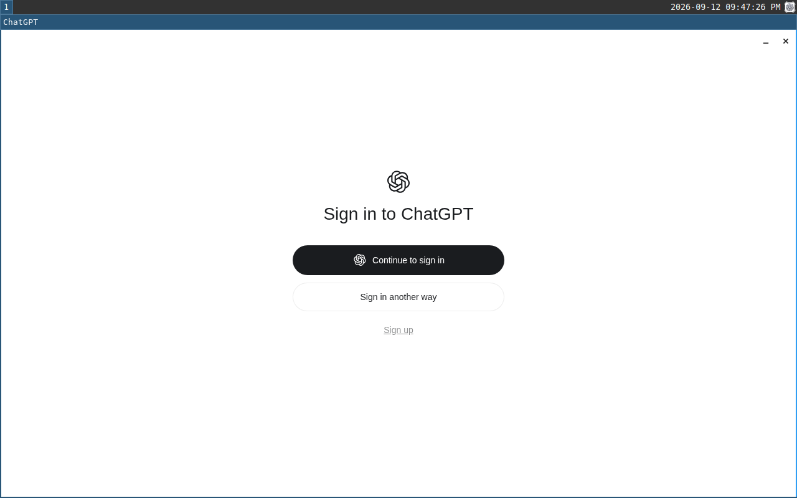

# ChatGPT Linux : paquet de compatibilité NixOS

Le paquet expérimental `packages.x86_64-linux.chatgpt-linux` utilise l'application officielle
OpenAI 26.908.40834. La source est le paquet amd64 versionné du dépôt de l'éditeur :

`https://persistent.oaistatic.com/codex-app-prod/linux/deb/pool/main/c/chatgpt/chatgpt_26.908.40834_amd64.deb`

SHA-256 : `da37b8e7bcefaaea019c478cacbe6c73ee1ddd15e0e1ebb3c7ef0a42dd818ac2`.
L'index Packages de ce dépôt annonce la même version et la même empreinte. L'archive téléchargée
a passé le contrôle de Nix. Aucun script d'installation Debian n'est exécuté sur l'hôte.

Les fichiers sont extraits sans correction ELF, remplacement d'Electron ou modification de
l'application. `buildFHSEnv` fournit les bibliothèques et chemins Linux usuels au lanceur d'origine.
La comparaison du binaire principal extrait de l'archive et de celui du magasin Nix donne
la même empreinte : `a5cc07d23381d8e9dcd2d91d6ff350a927a8c844cb99151bce6e937def39d6a6`.
L'environnement FHS assure la compatibilité ; il n'apporte pas les garanties de sandboxd, capd
et egress. Ce paquet n'est pas activé dans l'image installée tant que le bureau humain reste
à intégrer.

## Commandes et périmètre du test

```sh
nix build .#chatgpt-linux
nix build .#checks.x86_64-linux.chatgpt-desktop --print-build-logs
```

Le test construit une VM NixOS avec un compte ordinaire, Sway, XWayland et un rendu logiciel.
La connexion automatique est limitée à cette fixture. Le test bloque les sorties Internet de
la VM avant de lancer ChatGPT, ne connecte aucun compte et ne lit aucun fichier d'identifiants.
Il exige une fenêtre ChatGPT visible dans l'arbre du compositeur, vérifie le chemin exact de son
exécutable dans `/proc` et son appartenance au compte ordinaire. La reconnaissance de texte doit
ensuite retrouver l'écran « Sign in to ChatGPT » : une fenêtre encore sur le logo de chargement
ne suffit pas. Le test attend la fin de l'initialisation des plugins fournis et refuse les
erreurs de copie signalées par le client. Il capture l'écran, vérifie la disparition de la
fenêtre après sa fermeture par le compositeur, puis refuse toute erreur Fontconfig enregistrée
pendant ce parcours. Placer cette dernière assertion à la fin conserve les preuves des autres
contrôles même lorsque le défaut de polices fait échouer la vérification complète.

L'ouverture graphique et l'écran de connexion ont été observés le 12 septembre 2026 dans la VM
locale NixOS sous KVM, avec le paquet officiel. Le contrôle automatique de fenêtre, du binaire
et de l'UID 1000 a réussi ; la reconnaissance de texte a confirmé l'écran de connexion. Attendre
la fin d'initialisation a cependant découvert deux erreurs tardives : une copie de plugins
refusée et une erreur Fontconfig dans un renderer secondaire. La première est corrigée et
l'initialisation des plugins se termine ; la seconde empêche encore le test strict de réussir.

Résultat du dernier essai normal, sans instrumentation, avec le paquet conservé :

| Contrôle | Résultat |
|---|---|
| Fenêtre visible XWayland, classe `Chatgpt`, titre `ChatGPT` | Réussi |
| Exécutable officiel exact, compte UID 1000 | Réussi |
| Texte « Sign in to ChatGPT » reconnu à l'écran | Réussi |
| Plugins initialisés, absence des erreurs de copie précédentes | Réussi |
| Fermeture de la fenêtre et disparition de son identifiant dans Sway | Réussi |
| Absence d'erreur Fontconfig | **Échec** |
| Résultat global de `chatgpt-desktop` | **Échec, code 1** |



Cette capture provient du dernier essai décrit ci-dessus. Le bureau Sway visible est la fixture
du test ; ce n'est pas encore la session humaine livrée dans Prophet OS.

Défauts rencontrés et corrections apportées :

- Après une tentative de démarrage de Sway avortée, un ancien socket détournait le pilote de
  test de la nouvelle session. La fixture recrée maintenant son socket privé et attend une
  sortie active qui répond à l'IPC.
- Le client fournit la classe X11 `Chatgpt`, différente du nom commercial `ChatGPT`. Le test
  vérifie la classe observée, le titre, la visibilité, XWayland, le PID et le chemin du binaire.
- Désigner `/etc/fonts/fonts.conf` dans les variables Fontconfig permet de dessiner l'écran
  principal. Une observation des appels système confirme que le processus principal ouvre
  cette configuration. Le message « Cannot load default config file » vient d'un renderer
  secondaire. Remplacer les chemins par leurs cibles canoniques ou par une copie physique n'a
  pas corrigé cette erreur ; ces modifications ne sont pas conservées. Une exécution sous
  strace avait réussi, mais l'exécution normale suivante a reproduit le défaut : elle ne vaut
  donc pas validation. Aucun traçage n'est conservé dans le test de livraison.
  Un essai avec Fontconfig 2.17.1, dont le chargement effectif a été vérifié dans les mappings
  du processus, reproduit aussi le défaut. Le paquet conserve donc la bibliothèque du nixpkgs
  épinglé, sans déclassement ni modification de la sandbox du client.
- Le client recopie ses plugins intégrés et ajuste leurs manifestes. Les modes 0444/0555 du
  magasin Nix se propageaient dans cette copie, qui échouait sur `EACCES`. Le runtime monte
  une copie privée en mémoire des seules ressources de plugins et rend ses modes inscriptibles
  par leur propriétaire. Les octets distribués restent identiques ; aucun fichier de
  configuration utilisateur n'est lu ou corrigé par le lanceur. Cette copie représente
  environ 49 Mio pour cette version et disparaît avec le namespace de l'application.

Les premiers essais locaux utilisaient l'émulation TCG faute de droits KVM pour le constructeur
Nix. L'essai suivant a utilisé un accès temporaire à `/dev/kvm`, limité au groupe des
constructeurs puis retiré à la fin ; les droits initiaux ont été vérifiés après le test.
Le rendu est logiciel. Le temps global du test ne mesure ni les performances de ChatGPT ni
celles d'un GPU.

Cette vérification ne couvre pas une conversation authentifiée, les outils Codex, l'ouverture
de projets, les portails, le trousseau, les mises à jour, la reprise ou les performances GPU.
Ces parcours restent des conditions de livraison. L'application Linux est en aperçu et NixOS
ne figure pas parmi les distributions officiellement prises en charge ; XWayland est utilisé
ici conformément au mode de compatibilité documenté. Voir la
[documentation officielle](https://learn.chatgpt.com/docs/linux/linux-app) et l'
[ADR 0009](../adr/0009-clients-officiels-et-bureau.md).
