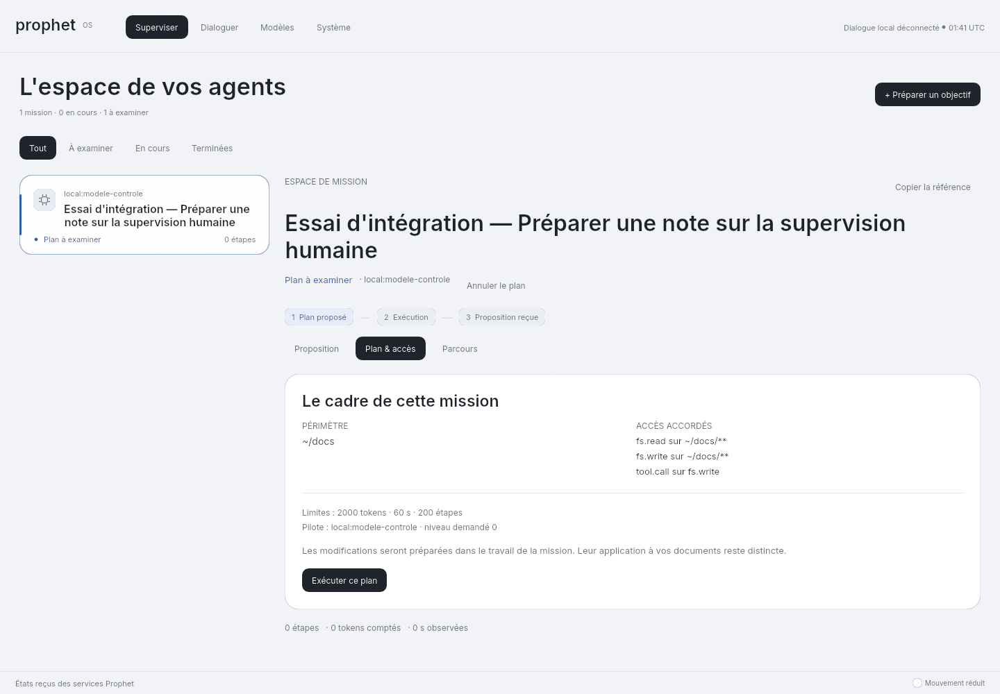
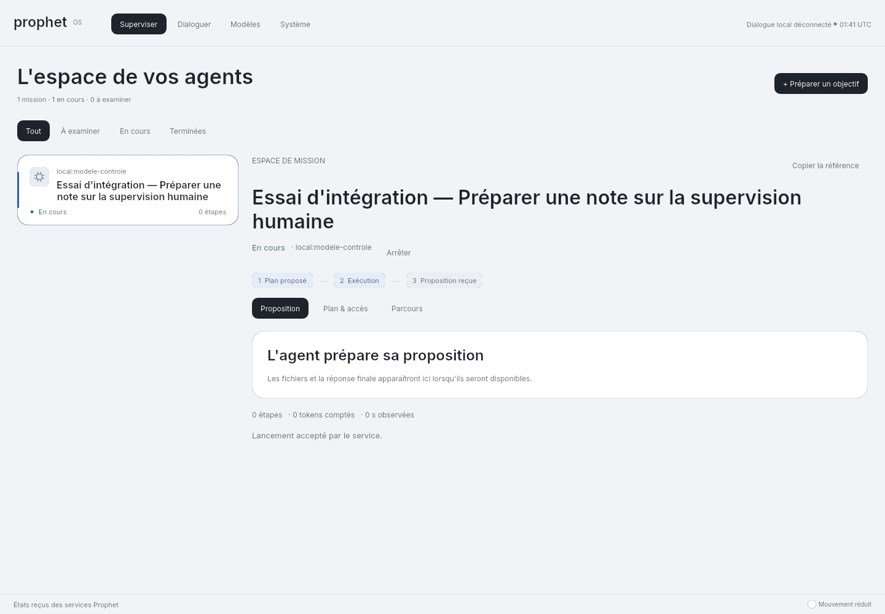
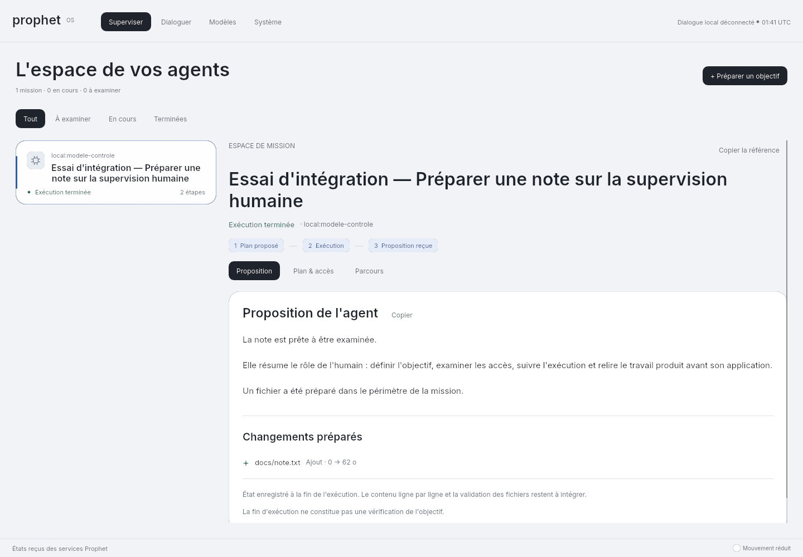
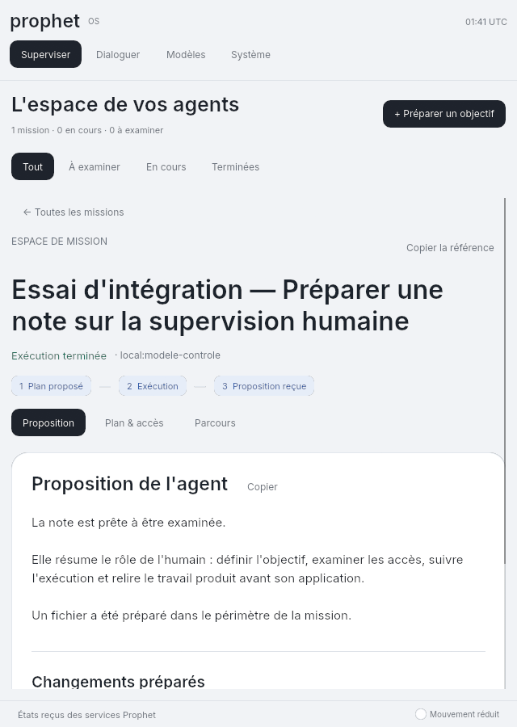
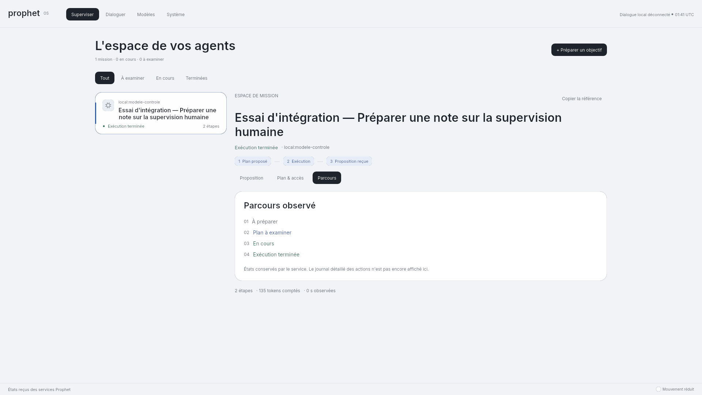
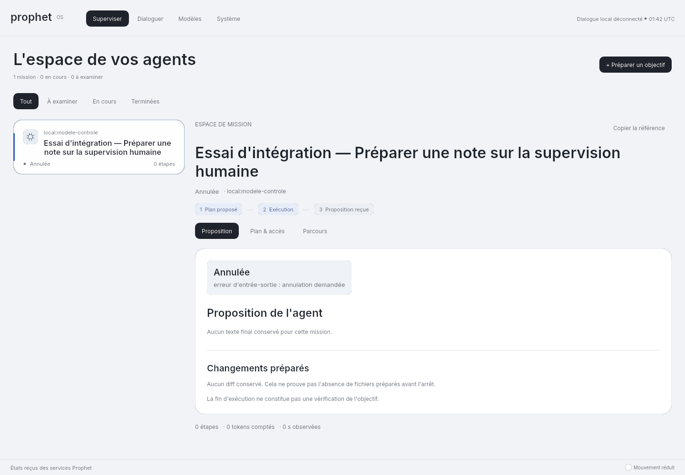
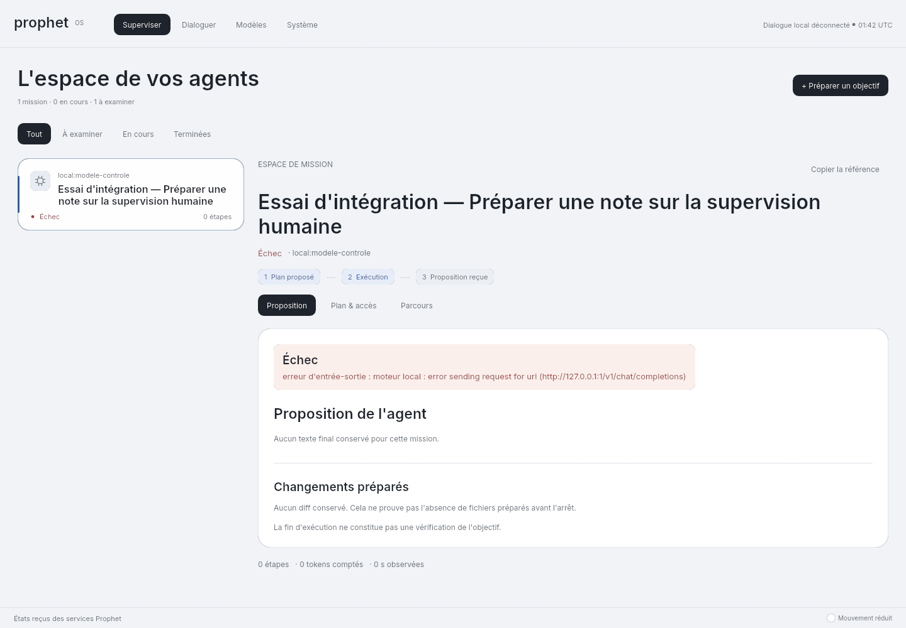

# Du plan au résultat dans l'espace natif — 13 septembre 2026

L'inspecteur de mission est raccordé à agentd. Une mission déjà planifiée expose ses accès,
ses limites et son pilote ; l'humain peut lancer le plan, demander l'arrêt, puis examiner
la réponse finale et la liste des fichiers préparés. Le résultat occupe la surface principale,
avec la liste des missions à gauche et un parcours compact Plan → Exécution → Proposition.

## Comportement

- `task.inspect` rend ensemble tâche, plan et résultat, sans jeton. Le service recontrôle les
  commandes reçues ; les indicateurs de l'inspecteur ne réservent pas de ressources.
- Les missions terminées, échouées et annulées restent consultables. La source les excluait
  auparavant malgré le filtre « Terminées ». Les neuf états du runtime ont des libellés distincts.
  Les lectures de la liste et de l'inspecteur réconcilient les transitions attestées ; une
  inspection ancienne perd ses commandes dès qu'un nouvel état est reçu dans la liste.
- Une seule commande peut être en cours. Une réponse ancienne ne remplace pas une autre mission
  sélectionnée. Les erreurs restent visibles, sans nouvel envoi automatique. Un acquittement
  d'arrêt ne transforme pas immédiatement la tâche en mission annulée.
- Le texte final est sélectionnable et copiable. Les changements sont les métadonnées du diff
  conservé, pas un aperçu inventé des fichiers. Le parcours montre les états enregistrés.
- Les lectures et commandes utilisent des connexions neuves et un délai de cinq secondes hors
  de la boucle de rendu. Les trois lectures de la source sont simultanées et son fil s'arrête
  après destruction. Un débit positif n'est plus inventé pour une mission sans temps mesuré.
- Le client IPC borne les messages à 8 Mio et refuse réponse tronquée, mauvaise corrélation,
  version incorrecte ou résultat/erreur ambigu. Un résultat JSON nul reste valide.

## Captures et nature de l'essai

Ces captures utilisent **les widgets natifs et trois vrais services** : agentd, capd et ledger.
Le serveur HTTP de modèle renvoie une séquence contrôlée par le test : un appel `fs.write`,
puis une réponse finale. L'intitulé « Essai d'intégration » et le pilote « modele-controle »
sont visibles. Ces images ne prouvent ni la qualité d'un LLM réel ni ses performances.















## Vérifications

Environnement : shell Nix du dépôt, Ubuntu 24.04 sous WSL2, Rust 1.97.1, egui 0.36.2,
wgpu 30, pilote logiciel Vulkan Mesa 26.2.2. Ce rendu ne mesure pas une accélération d'inférence.

La nouvelle inspection a d'abord échoué avec `MethodNotFound`. Le premier parcours graphique
a également révélé un bouton de lancement hors de la zone visible du plan : sa disposition
a été corrigée et les clics de test vérifient maintenant aussi le rectangle réellement visible.
Les captures ont ensuite révélé un décalage entre l'état annulé de l'inspecteur et l'ancien état
en cours de la liste. La réconciliation des transitions le corrige et fait l'objet d'une régression.
Un essai d'arrêt a rencontré un délai de lecture de cinq secondes, puis a réussi lors de
l'exécution isolée. La cause de ce délai n'est pas établie ; ce passage ne constitue pas une
correction démontrée de cette intermittence.

Le parcours graphique vérifie le lancement par clic, la réponse complète copiée sans modification,
la présence du fichier dans le travail SFS et son absence dans les documents d'origine. Il
exerce 640, 1280, 1440 et 1920 pixels de large. Le second parcours clique sur l'arrêt d'une
requête HTTP en attente, vérifie l'état annulé, puis exerce un moteur absent et le filtre terminé.
Les tests ordinaires couvrent également double commande, réponse ancienne, erreurs de lecture,
annulation non optimiste et validation des réponses IPC.

`nix develop --command just check` réussit : **615 tests réussis, aucun échec, 24 ignorés**,
format, clippy, reconstruction des binaires, contrôles des services et recherche de secrets.
La suite graphique exécutée séparément réussit : **14 tests, aucun échec**, dont les deux
nouveaux parcours de mission avec les vrais services et un modèle contrôlé. Elle produit les
12 captures de ce jalon. Les images finales ont été examinées, notamment la cohérence de
l'état annulé entre la liste et l'inspecteur, ainsi que le résultat à 640 pixels de large.

Commandes reproductibles (les binaires voisins des tests doivent être reconstruits) :

```sh
nix develop --command just check
PROPHET_CAPTURE_DIR="$PWD/docs/images" nix develop --command \
  cargo test -p surface -- --ignored --test-threads=1 --nocapture
```

Sous WSL, le pilote logiciel de cet essai est sélectionné par `VK_DRIVER_FILES`, pointant vers
`share/vulkan/icd.d/lvp_icd.x86_64.json` dans le paquet Mesa de Nix. La CI utilise Mesa Ubuntu.
Sans pilote, le test échoue ; il ne transforme pas l'absence de rendu en réussite.

## Limites restantes

La conversation ne crée pas encore un plan de mission. Le lanceur accepte les outils natifs de
confiance au niveau 0 ; les processus isolés et les clients officiels ne sont pas raccordés à
ce parcours. Le détail ligne par ligne, la vérification de l'objectif, la validation des fichiers,
leur undo robuste, les checkpoints et le journal détaillé des actions restent à intégrer.
Les acquittements de commande ne corrigent pas le contrat historique des approbations capd.

Les trois échecs Qwen3-0.6B du jalon précédent restent valables : aucune réussite avec un LLM
réel dans la chaîne agentd complète n'est ajoutée par cet essai contrôlé. La compatibilité
ChatGPT sous NixOS reste en échec sur le contrôle Fontconfig dans la CI de `a91ed22`, alors que composants, isolation et
rendu ont réussi ([run 34728460203](https://github.com/speed25200-cyber/Prophet_OS/actions/runs/34728460203)).
Les sessions authentifiées Claude Code/ChatGPT, le bureau humain installé, le matériel physique
et les mesures comparatives restent ouverts. La fluidité et la qualité visuelle de référence
ne sont pas démontrées par ces captures. Les exigences [FRONTIER](../FRONTIER.md) restent ouvertes.
