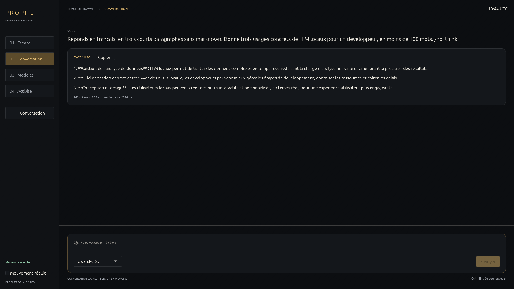
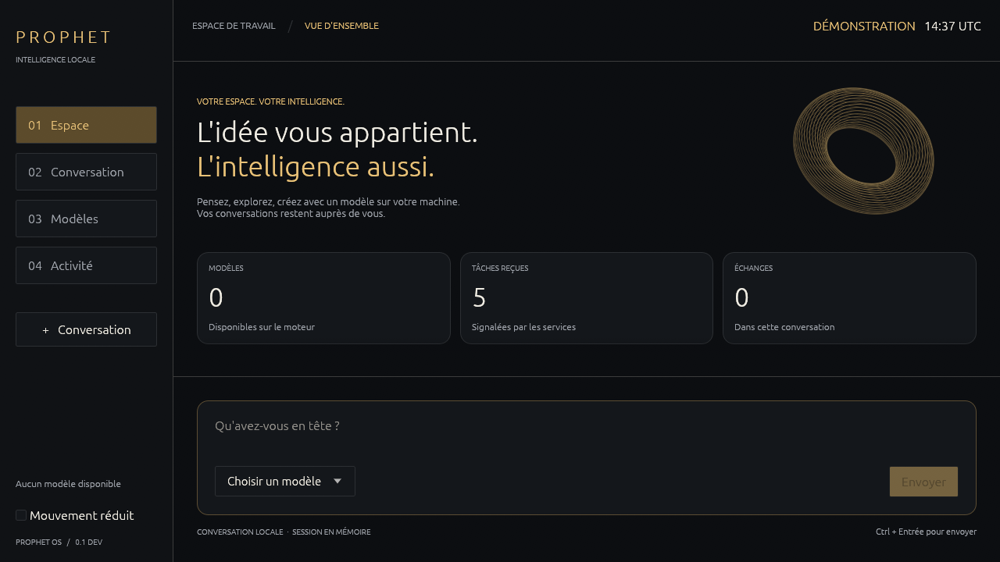
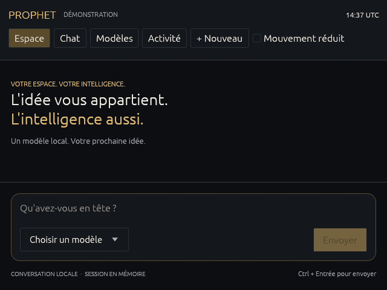
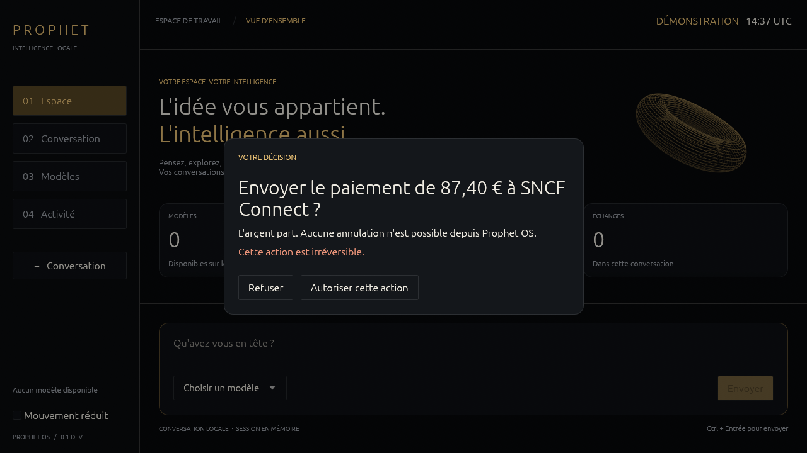
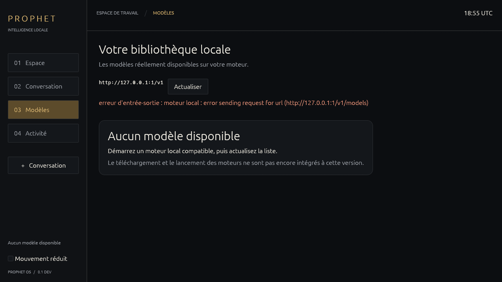

# Espace natif et conversation locale — 12 septembre 2026

L'espace de travail possède maintenant quatre pages natives : accueil, conversation, modèles
et activité. Il découvre les modèles d'un moteur local déjà lancé, reçoit le texte en flux,
copie les réponses et permet d'interrompre une génération. Les tâches et les décisions affichées
proviennent des services. Une conversation directe n'exécute pas d'outils système.

## Captures vérifiées

Accueil réel, moteur llama.cpp et Qwen3-0.6B disponibles ; aucun daemon de tâches connecté :

Réponse produite par Qwen3-0.6B sur CPU, sans correction du texte du modèle :

Cette réponse a consommé 140 tokens de sortie en 6,33 secondes, avec un premier fragment de texte
à 2 586 ms. C'est un essai fonctionnel unique, pas une comparaison de performances ni une
validation de la qualité du petit modèle. Le texte est actuellement affiché sans interpréter
Markdown : les astérisques visibles viennent de sa réponse.

Les états suivants utilisent des données de démonstration et portent cette mention dans l'image :

Échec réel de connexion à un port sans moteur :

## Vérifications exécutées

Environnement : Ubuntu 24.04 sous WSL2, Rust 1.97.1 dans le shell Nix épinglé,
wgpu 30, egui 0.36.2, Mesa 26.2.2, Vulkan llvmpipe LLVM 21.1.8. Le rendu est logiciel ;
ces essais ne prouvent aucune accélération d'inférence par un GPU physique.

- `nix develop --command just check` : format, clippy sans avertissement, 563 tests réussis,
  aucun échec, 16 tests ignorés ; contrôles des services, du durcissement déclaré et de la
  documentation, puis recherche de secrets dans l'historique. Les tests ignorés ne sont pas
  comptés comme réussis.
- `nix develop --command cargo test -p surface -- --ignored --nocapture`, avec l'ICD Vulkan
  llvmpipe : les 9 tests de rendu réussissent. Ils exercent les quatre pages à 640 × 480,
  1280 × 720 et 1920 × 1080, la navigation, la saisie Unicode, le collage, la distinction
  Entrée/Ctrl+Entrée, la lisibilité du panneau de décision et l'ancien rendu d'observation.
- Essai dans une vraie fenêtre WSLg/Wayland : première image soumise avec succès, puis fermeture
  par le délai d'essai. Ce contrôle a révélé et permis de corriger le format RGBA imposé à une
  surface qui exigeait BGRA. Le format est maintenant négocié avec le système de fenêtres.
- Tests du transport en flux : fragmentation des octets UTF-8, fin et consommation obligatoires,
  refus des flux incomplets, et interruption même si le serveur ne répond pas encore. Le serveur
  de test constate alors la fermeture de la connexion.
- Un vrai flux Qwen3 a également réussi : 10 fragments, premier texte à 316 ms, total 535 ms,
  14 tokens de sortie. Voir [l'environnement du modèle](local-inference-2026-09-12.md).
- `nix develop --command gitleaks detect --no-git --source . --no-banner --redact` : aucun secret
  détecté dans l'arbre de travail.
- Évaluation Nix du paquet et du service graphique : bibliothèques Wayland/Vulkan incluses,
  accès HTTP limité à la boucle locale. L'image installée et l'application effective de cette
  règle systemd n'ont pas été réexercées après ce changement.

## Limites de ce jalon

Les conversations restent en mémoire. L'interface ne gère pas encore le téléchargement,
le démarrage et l'arrêt des moteurs, les budgets de VRAM, les tâches agentiques complètes,
les fichiers et leurs différences, ni leur validation et annulation. Le budget d'historique
est une limite de taille, pas une mesure par le tokenizer du modèle.

Le mouvement réduit, la navigation clavier et l'intégration AccessKit sont présents ; le parcours
avec un lecteur d'écran réel reste à tester. Les latences de rendu p95, la consommation au repos
et le comportement des pilotes GPU physiques restent à mesurer. Aucun résultat de ce rapport
ne suffit à qualifier Prophet OS de système complet ou SOTA. Les conditions de livraison restent
dans [FRONTIER.md](../FRONTIER.md).
