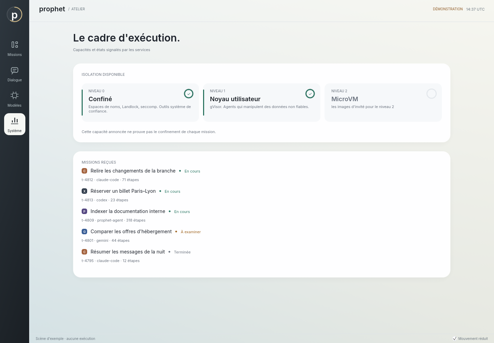

# Les instruments de l'atelier — 13 septembre 2026

Passe visuelle après `a3659fd`, sur le binaire natif, rendue et vérifiée avec un GPU logiciel
(llvmpipe). L'atelier gardait sa composition claire mais disait tout par des mots et des
chiffres ; il dit maintenant l'essentiel par des formes, sans rien animer au repos.

## Ce qui change

- **Le rail** n'est plus un aplat : une lumière descend du haut, et l'emblème `p` est cerclé
  d'un anneau qui se remplit avec la part de missions actives. Rien n'y bouge tant que l'état
  ne change pas.
- **Les missions** portent une bande de couleur d'état à gauche, un anneau de budget en haut à
  droite et le monogramme de leur pilote : `C` Claude Code, `X` Codex, `G` Gemini, `L` moteur
  local, `P` boucle native. On reconnaît qui travaille avant de lire.
- **La Focale** remplace deux grands nombres et une barre par trois instruments : étapes,
  activité avec son échelle à cinq traits, budget avec son anneau. L'inspecteur relié aux
  services reçoit la même ligne en forme compacte, pour que la proposition et ses fichiers
  restent visibles sans défiler.
- Le module `instruments` fournit l'arc, l'anneau, le monogramme et la ligne d'instruments ;
  ses tests vérifient les monogrammes et la géométrie des arcs.
- **Le Système montre l'échelle d'isolation** : trois niveaux, ceux que la machine offre en
  couleur et cochés, le premier inatteignable avec ce qui lui manque, et les missions reçues
  avec le monogramme de leur pilote.

  

- **Le Parcours dit où l'agent est allé.** L'onglet relit le journal de la mission et liste
  chaque appel d'outil avec sa cible contrôlée — hôte, chemin, fenêtre — et son issue :
  réussi, en erreur avec son code, ou refusé avec son motif ; puis la publication et
  l'annulation. Le contenu lu ou écrit n'y figure jamais : le journal ne le contient pas.
  Le test d'inspecteur vérifie que l'appel `fs.write` sur `docs/note.txt` y apparaît réussi.

## Vérifications

| Contrôle | Résultat local |
| --- | --- |
| `cargo test -p surface --lib` | 54 réussis |
| `cargo test -p surface --test bureau --test rendu -- --include-ignored` (llvmpipe) | 15 réussis : repos sans animation, blanc translucide, tailles, décision, focale, mille missions |
| `cargo test -p surface --test missions -- --include-ignored` (services réels, modèle contrôlé) | voir ci-dessous |
| `cargo clippy -p surface --all-targets -- -D warnings`, `cargo fmt --all --check` | réussis |

La première forme des instruments dans l'inspecteur relié cachait le bouton « Examiner » du
premier fichier sous le défilement à 1440 × 1000 ; le test l'a relevé, et la forme compacte
le corrige. Les captures de `docs/images/atelier-*.png` et `surface-mission-*.png` sont
régénérées avec cette passe, par le binaire et les tests, en rendu logiciel.

## Limites

Le rendu logiciel ne mesure ni la fluidité ni la consommation sur une carte graphique réelle.
La direction reste celle de l'ADR 0019, thème clair sans sculpture ; cette passe n'introduit
aucune animation. La session humaine complète, les captures sur écran physique et les mesures
matérielles attendues par FRONTIER restent ouvertes.
