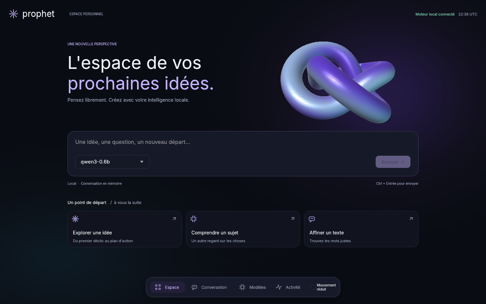
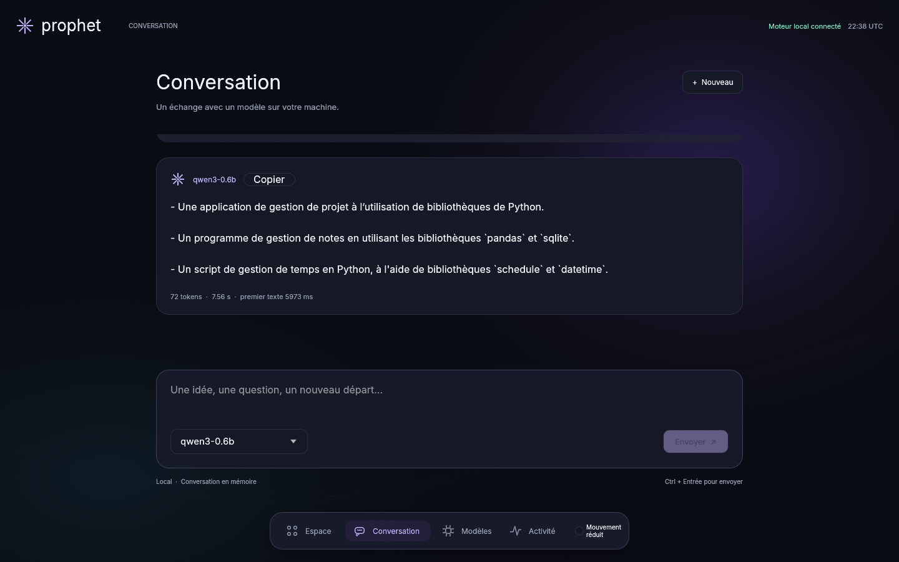
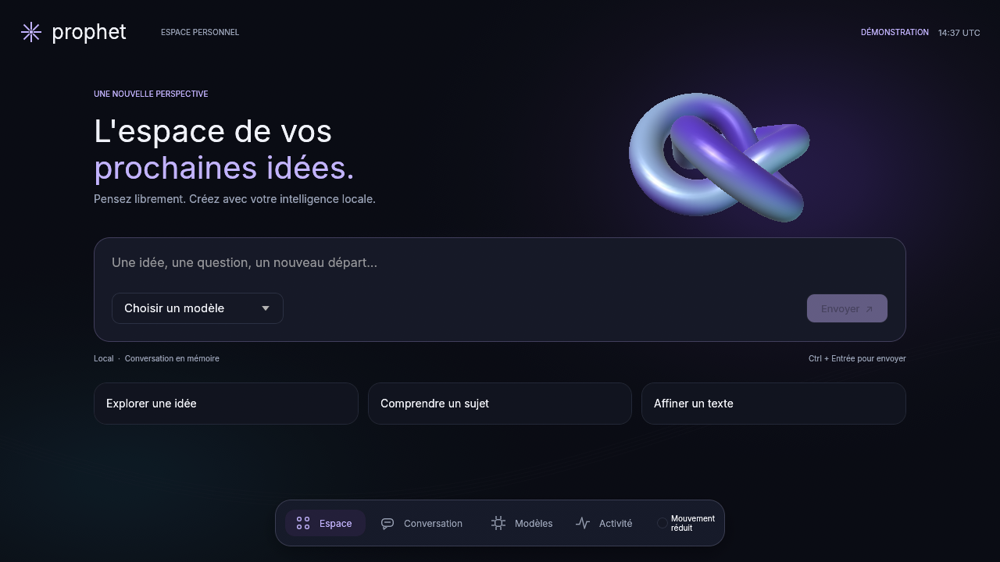
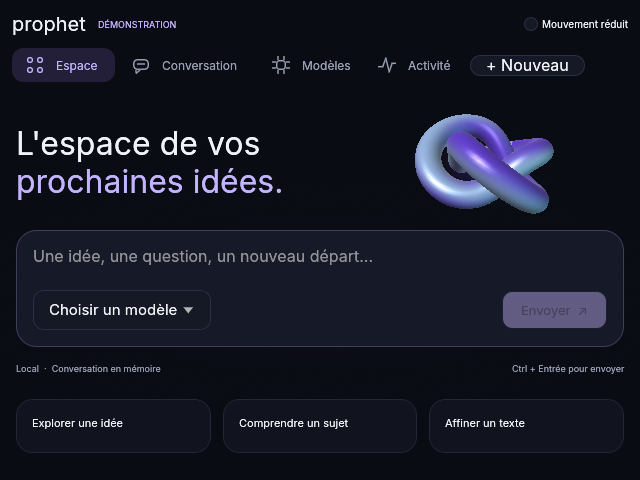
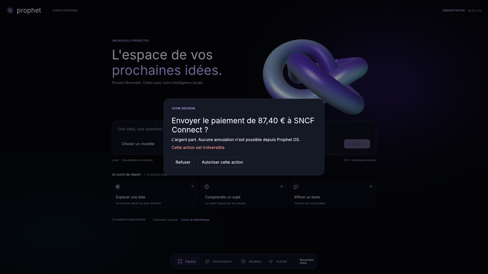
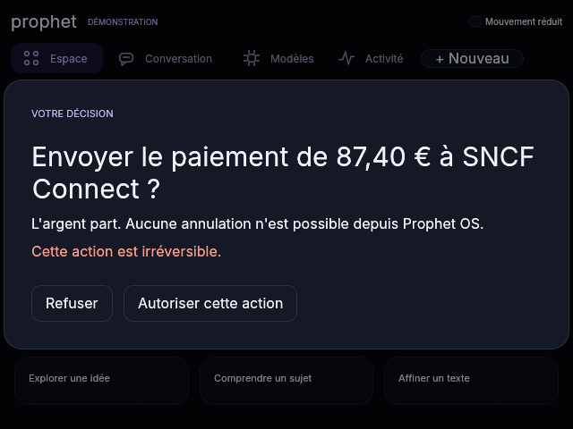
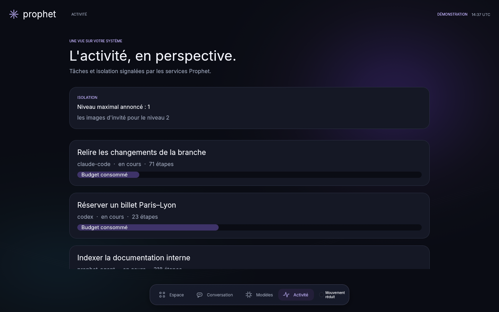
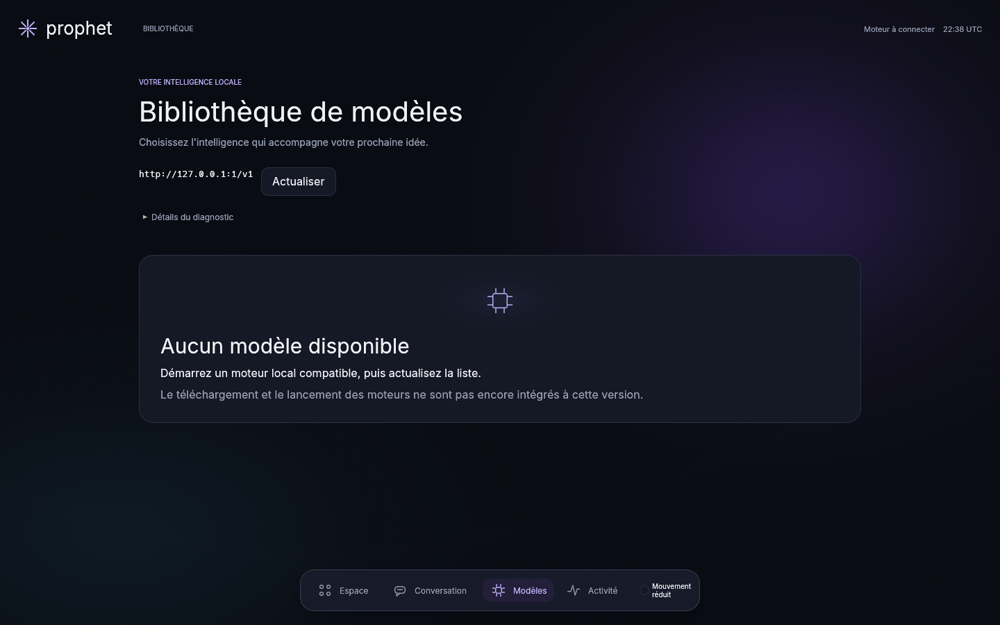

# Interface native Iris — 13 septembre 2026

Direction remplacée à la demande de l'utilisateur par l'[espace de supervision](supervision-2026-09-13.md).
Les captures ci-dessous documentent le jalon historique `72545c0`.

L'accueil, la conversation, la bibliothèque et l'activité partagent une nouvelle direction
visuelle : fond nuit éclairé, sculpture 3D irisée, dock flottant, pictogrammes vectoriels,
typographie Inter et panneaux arrondis. L'accueil intègre directement la saisie et les points
de départ ; la conversation limite la largeur de lecture. Les erreurs détaillées du moteur
sont disponibles dans un diagnostic repliable.

La sculpture est une géométrie native préparée une fois, puis projetée et éclairée à chaque
image. Son cadrage suit ses dimensions projetées pour éviter les bords coupés. Les couleurs
et les mouvements n'indiquent aucune mesure de charge. Le dessin utilise uniquement des
ressources locales. Le mode « Mouvement réduit » conserve une image fixe de la sculpture.

## Captures du binaire

Accueil à 1440 × 900, moteur llama.cpp/Qwen3 local réellement découvert :



Conversation avec une réponse générée par Qwen3-0.6B-Q8_0 sur CPU, sans modification du texte :



Il s'agit d'un essai de fonctionnement de l'interface, pas d'une évaluation de la qualité du
modèle ou d'un benchmark de performances. La conversation reste en mémoire.

Les vues suivantes utilisent explicitement des données de démonstration :











Moteur réellement absent sur un port fermé :



## Vérification

Environnement : Ubuntu 24.04 sous WSL2, Rust 1.97.1 via le shell Nix du dépôt, egui 0.36.2,
wgpu 30 et llvmpipe/Mesa 26.2.2.

- `just check` réussit : format, clippy, 576 tests réussis, aucun échec, 18 ignorés et
  contrôles du dépôt, dont les services et la recherche de secrets.
- Les dix tests graphiques lancés explicitement réussissent : quatre tests de l'espace
  natif et six tests du rendu historique. La navigation, la saisie Unicode, le collage,
  les contrôles visibles, les décisions et le mouvement réduit sont exercés.
- Le binaire final produit les huit captures ci-dessus, relues après rendu. L'accueil
  découvre le vrai moteur ; la conversation reçoit sa réponse complète. Les autres états
  sont identifiés comme démonstration ou comme moteur absent.
- Un lancement fenêtré sous WSLg soumet sa première image à Wayland avec llvmpipe. Cet essai
  est borné par `timeout 12s` ; il ne vérifie ni une session prolongée ni une fermeture normale.
  Le lanceur Nix rend le code 1 après l'arrêt borné, sans diagnostic supplémentaire du binaire.

Commandes reproductibles, avec un adaptateur Vulkan disponible :

```sh
nix develop --command just check
nix develop --command cargo test -p surface -- --ignored --test-threads=1 --nocapture
nix develop --command cargo run -p surface --bin prophet-surface -- \
  --capture iris-accueil.png --largeur 1440 --hauteur 900 --endpoint http://127.0.0.1:18080/v1
nix develop --command cargo run -p surface --bin prophet-surface -- \
  --capture iris-compact.png --largeur 1280 --hauteur 720 --demonstration
nix develop --command cargo run -p surface --bin prophet-surface -- \
  --capture iris-640.png --largeur 640 --hauteur 480 --demonstration
```

Le [rapport du moteur local](local-inference-2026-09-12.md) donne le modèle, son empreinte et
la commande de démarrage de llama.cpp. Les tests d'interaction visent les identifiants des
contrôles rendus, pour ne pas dépendre de l'ancienne position de la barre latérale. Ils exigent
que la zone de saisie et les trois raccourcis soient entièrement dans leur zone d'interaction
visible à chaque taille testée. Une capture 720p avait révélé leur découpe ; les raccourcis sont
maintenant compacts lorsque la hauteur manque.

Cette refonte concerne l'espace natif. La session humaine avec plusieurs applications,
l'intégration complète de ChatGPT et de Claude Code, la persistance et les outils agentiques
restent suivis dans [FRONTIER.md](../FRONTIER.md). Le rendu logiciel utilisé ici ne prouve pas
les performances sur un GPU physique. Les réponses restent affichées en texte brut, y compris
leurs marqueurs Markdown ; leur mise en forme sémantique reste à intégrer.
