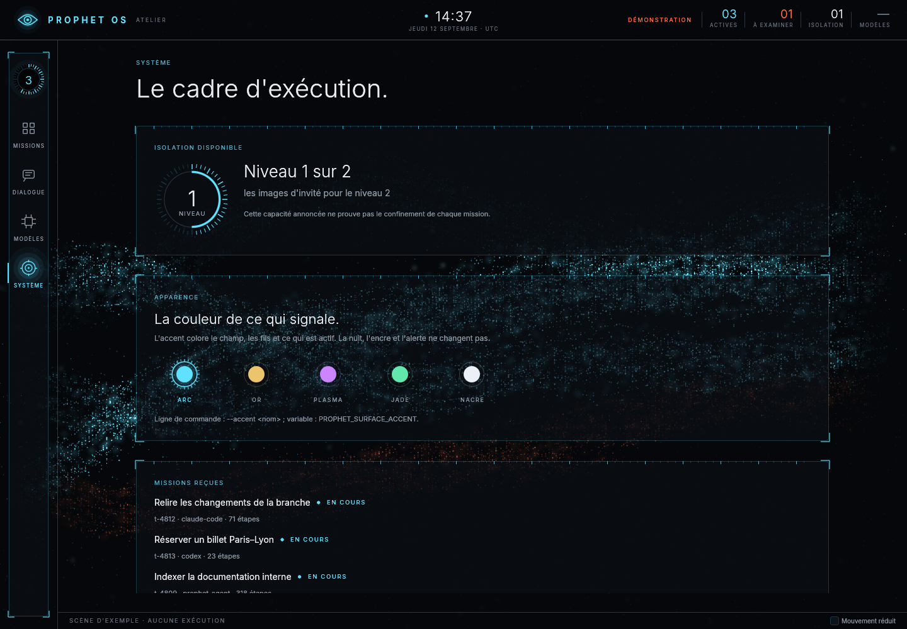

# Direction Réacteur — 13 septembre 2026

Refonte graphique de l'atelier après `7d19592`, dans le commit portant ce rapport, à la demande
de l'utilisateur : un espace « jamais vu », science-fiction, plus aéré, plus professionnel,
plus spectaculaire, avec une couleur personnalisable. L'[ADR 0025](../adr/0025-direction-visuelle-reacteur.md)
décrit la direction et ses limites. Ce rapport dit ce qui a été rendu, vérifié et mesuré, sur un
rastériseur logiciel (llvmpipe, Vulkan), sans carte graphique.

## Ce qui change

- **La nuit et le verre.** Fond presque noir, à peine froid ; plaques de verre translucides à
  crochets d'angle et bord gradué ; encre claire ; capitales espacées pour rubriquer ; Inter en
  trois graisses du même fichier variable, la fine pour les grands chiffres et les titres.
- **Un accent au choix.** *Arc* (cyan, par défaut), *Or*, *Plasma*, *Jade*, *Nacre*. Il colore
  le champ, les fils, les crochets, les lueurs et ce qui est actif ; la nuit, l'encre, l'alerte
  et la menthe de l'accompli ne changent pas. Le choix se fait dans la page Système (cinq
  pastilles), se conserve dans `$XDG_CONFIG_HOME/prophet/surface.json`, et se force par
  `--accent` ou `PROPHET_SURFACE_ACCENT`. Un test vérifie le contraste WCAG de chaque accent
  sur le verre (AAA pour l'accent vif et le texte d'un bouton, AA pour l'accent sourd) et
  qu'aucun accent ne se confond avec l'alerte.
- **Le champ.** Derrière les plaques, un seul appel GPU instancié dessine une grille de points
  fixes, une voûte de grains fixes et, pour chaque mission reçue, un ruban de treize fils qui
  avancent à la vitesse réelle de ses étapes. La clarté dit le budget qui reste, la teinte passe
  à l'alerte quand une décision attend, la mission choisie s'éclaire. Un ruban arrêté ne bouge
  pas ; le mouvement réduit fige tout ; le bureau ne redessine à la cadence de l'écran que tant
  qu'un ruban avance.
- **Le tableau de bord.** Une barre du système qui ne relève que des comptes reçus (actives,
  à examiner, isolation, modèles) et l'heure de la scène ; un rail de verre avec l'anneau des
  missions actives ; une liste de missions virtualisée sur sa plaque ; un espace de mission avec
  le cadran de la mission (une graduation par étape, l'arc du budget, le nombre d'étapes) et
  trois jauges graduées ; un panneau de décision cerclé d'alerte.
- **La composition respire.** Liste à gauche, espace de mission à droite, de l'air entre les
  deux ; la Focale retire la liste ; à petite largeur, liste et espace se remplacent.

## Captures

Toutes proviennent du binaire natif, en rendu logiciel. Les scènes de démonstration portent la
mention « DÉMONSTRATION » et leur relevé de modèles est un tiret : elles ne prouvent aucune
session réelle de Claude, Codex ou Gemini.

| Vue | Capture |
|---|---|
| Missions de démonstration, accent Arc | [1920 × 1080](../images/reacteur-galerie-1920.png) |
| Accent Or | [1920 × 1080](../images/reacteur-or-1920.png) |
| Accent Plasma | [1920 × 1080](../images/reacteur-plasma-1920.png) |
| Accent Jade | [1920 × 1080](../images/reacteur-jade-1920.png) |
| Accent Nacre | [1920 × 1080](../images/reacteur-nacre-1920.png) |
| Espace vide, services absents, état réel | [1440 × 1000](../images/reacteur-vide-1440.png) |
| Décision en attente | [1440 × 1000](../images/reacteur-decision-1440.png) |
| Examen d'une décision | [1440 × 1000](../images/reacteur-examen-1440.png) |
| Petite largeur | [640 × 900](../images/reacteur-compact-640.png) |
| Système, avec le choix d'accent | [1440 × 1000](../images/reacteur-systeme-1440.png) |
| Dialogue | [1440 × 1000](../images/reacteur-dialogue-1440.png) |
| Modèles | [1440 × 1000](../images/reacteur-modeles-1440.png) |
| Préparation d'une mission (parcours du bureau) | [1280 × 720](../images/reacteur-preparation-1280.png) |
| Focale, scène contrôlée de deux missions (parcours du bureau) | [1440 × 1000](../images/reacteur-focale-1440.png) |
| Recherche parmi mille missions contrôlées (parcours du bureau) | [1440 × 1000](../images/reacteur-recherche-1440.png) |
| Comparaison des versions, vrais services et moteur contrôlé (parcours de mission) | [1440 × 1000](../images/reacteur-fichier-1440.png) |

## Vérifications

| Contrôle | Résultat local |
| --- | --- |
| `cargo test -p surface --lib` | 64 réussis, aucun échec |
| `cargo test -p surface --test bureau --test rendu --test preparation --test branchement -- --include-ignored` (llvmpipe) | 20 réussis, aucun échec : 11 parcours du bureau, 6 tests du renderer historique, 1 de préparation, 2 de branchement |
| `cargo test -p surface --test missions -- --include-ignored` (vrais capd, ledger, agentd, modèle HTTP contrôlé) | 5 réussis, aucun échec, en 28,04 s |
| `cargo fmt --all --check`, `cargo clippy --all-targets --all-features -- -D warnings` | réussis, aucun avertissement |
| `just check` (équivalent manuel, Nix absent de cette session) | format, clippy, construction des programmes et `cargo test --workspace` : 428 réussis, 3 ignorés, **1 échec propre à cette session** (voir ci-dessous) ; `verifier-les-services`, `verifier-le-durcissement` et `verifier-la-doc-des-travaux` réussis ; la recherche de motifs de secrets sans gitleaks relève la chaîne d'essai `sk-ant-api03-secret` du test d'exfiltration d'egress, présente avant cette révision |

L'échec de `providers::official::tests::un_fichier_de_configuration_ne_prouve_pas_une_connexion`
ne vient pas de cette révision, qui ne touche pas ce crate : la session de construction dispose
d'un vrai client Claude Code connecté, et la sonde du pilote — qui interroge le client sans
lire ses fichiers d'identifiants — répond « connecté » même pour un répertoire de configuration
vide. Le test suppose une machine sans session ouverte ; il passe en intégration continue.

Deux tests graphiques sont ajoutés. Le premier rend une mission en cours à deux instants et
exige que l'image change, puis qu'elle ne change plus sous mouvement réduit, puis qu'une mission
arrêtée donne deux images identiques. Le second rend trois missions sous l'accent Arc puis sous
l'accent Or et exige, pour chacun, un fond de nuit (plus de 60 % de pixels sombres), une
lumière dont plus de 70 % des pixels colorés sont de la teinte de l'accent ou de l'alerte, et
un coin d'écran sombre sans être un noir absolu ; puis que les deux images diffèrent.
Les parcours existants — navigation, saisie Unicode, tailles, décision, filtres, Focale, mille
missions, petite fenêtre — passent sans modification de leurs identifiants.

Le test de mille missions mesure **82,042 ms en médiane et 89,156 ms en p95** pour la composition et la soumission d'une image à
1440 × 1000, contre 8,592 / 13,785 ms avant cette refonte. La différence est le champ sur un
rastériseur logiciel : au plus 3 000 grains, 2 800 points de grille et 60 000 particules par
image, dont les halos coûtent le plus. Cette mesure ne dit rien d'une carte graphique.

## Limites

Le rendu logiciel ne mesure ni la fluidité ni la consommation sur un écran physique ; ces
mesures restent dues au critère d'interface de FRONTIER. La qualité visuelle sur un vrai écran
reste à apprécier par l'utilisateur. La conservation de l'accent suppose un répertoire de
configuration inscriptible ; sur l'image installée, le compte `surface` n'en a pas encore un
de vérifié, et l'interface le dit quand l'écriture échoue. Les captures pèsent environ un
mégaoctet chacune à 1920 × 1080 : le champ ne se compresse pas comme un aplat.
