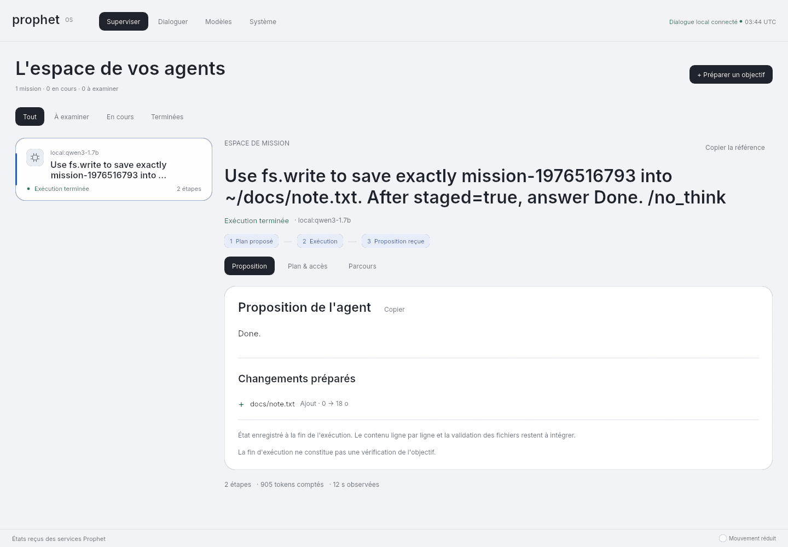

# Raccordement du moteur local au système et au parcours graphique

13 septembre 2026, après `395ecbb`. Parcours graphique vérifié ; test système transmis à la CI.

## Première preuve graphique

Qwen3-1.7B-Q8_0 et le moteur Nix corrigé ont exécuté une intention saisie dans les widgets
de la surface native. Le test clique sur la préparation puis le lancement, observe l'état
réel et vérifie le contenu exact du fichier conservé dans l'espace de travail. Aucun serveur
HTTP contrôlé ne répond au modèle dans cet essai.

Premier passage : `mission-1272476470`, résultat exact, 14,36 secondes entre le clic de
lancement et les dernières vérifications, 120 compositions pendant l'état d'exécution.
Le temps de la commande complète, compilation comprise, est de 92,424 secondes. Ce sont des
observations sur CPU et rendu logiciel, pas une mesure de fluidité sur écran ni un benchmark p95.
Le fichier original est absent ; seul le fichier de travail existe.

Après ajout de la découverte du modèle du dialogue, comme au démarrage normal de la fenêtre,
les trois nouveaux passages réussissent :

| Contenu demandé et vérifié | Du lancement aux vérifications | Images composées pendant l'exécution |
|---|---:|---:|
| `mission-855975299` | 14,114 s | 117 |
| `mission-1179953533` | 12,275 s | 101 |
| `mission-1976516793` | 13,274 s | 110 |

Les commandes complètes prennent 49,722 s, 17,572 s et 18,103 s ; la première inclut 31,50 s
de compilation. Les trois passages utilisent le même serveur possédé par le script et le
même fichier de poids vérifié. Il s'agit toujours d'une tâche simple répétée avec un contenu
variable, et d'un rendu natif hors écran ; aucune performance de session Wayland installée
ni fiabilité générale du modèle n'en est déduite.



Le test ajoute la feature explicite `real-model-tests`. Les captures contrôlées de la CI
n'exigent donc pas de poids. Un essai réel explicitement demandé exige ses variables de moteur
et de modèle ; leur absence provoque un échec.

## Reproduction

Dans `nix develop`, après `cargo build --workspace --bins` :

```sh
python3 tools/verifier-moteur-local.py \
  --llama-server /chemin/du/paquet/bin/llama-server \
  --weights /chemin/Qwen3-1.7B-Q8_0.gguf --model qwen3-1.7b \
  --output /chemin/nouveau-rapport --repetitions 3 --surface
```

Un adaptateur Vulkan est requis ; `VK_DRIVER_FILES` peut sélectionner le rastériseur logiciel.
Le rapport contient les commandes, l'empreinte des poids, les journaux, les résultats et les
captures de chaque passage. Le serveur créé par le script est arrêté après les essais.

Le test des services installés se lance par `just test-local-engine-vm`. Il exige KVM,
4 Go de RAM pour la VM, de l'espace pour son disque et les poids. Le fichier officiel est
épinglé à la révision `90862c4b9d2787eaed51d12237eafdfe7c5f6077` du
[dépôt Qwen](https://huggingface.co/Qwen/Qwen3-1.7B-GGUF).
SHA-256 : `061b54daade076b5d3362dac252678d17da8c68f07560be70818cace6590cb1a`.

## Périmètre

Le [module et ses permissions](../adr/0017-moteur-installe-et-contexte-partage.md) raccordent
les paramètres communs aux services et au dialogue. L'évaluation Nix de la VM et de l'image
réussit. La construction locale de la VM a été interrompue : le disque hôte n'avait plus que
6 Go libres. Environ 15 Go de cache incrémental propre à cette tâche ont ensuite été supprimés
dans Linux, sans récupération physique confirmée sur Windows. Le nouveau travail CI
`Mission locale sous NixOS (modèle réel)` doit établir le résultat de construction et d'exécution.
Le paquet Rust utilise maintenant un ensemble de sources limité au code, à ses ressources,
aux manifestes, exemples et politiques : les rapports et captures ne l'invalident plus.

`nix develop --command just check` réussit : 622 tests, aucun échec, 25 ignorés ; format,
clippy, construction des programmes et contrôles du dépôt passent. Le premier lancement
de cette commande avait été interrompu pour réduire le cache ; seul le lancement complet
suivant est compté comme réussi.
Les 15 tests graphiques contrôlés passent également après le changement du montage de test.
Leur serveur HTTP contrôlé reste distinct du moteur Qwen des essais réels.

Ce jalon ne transforme pas le kiosque en bureau humain,
ne valide pas l'authentification des clients officiels et ne livre pas la direction visuelle
spectaculaire demandée.

La CI de `395ecbb` a réussi le protocole du moteur, les composants, l'isolation et la surface.
Son test ChatGPT reste en échec. Cette CI ne valide pas les nouvelles modifications de ce rapport.
