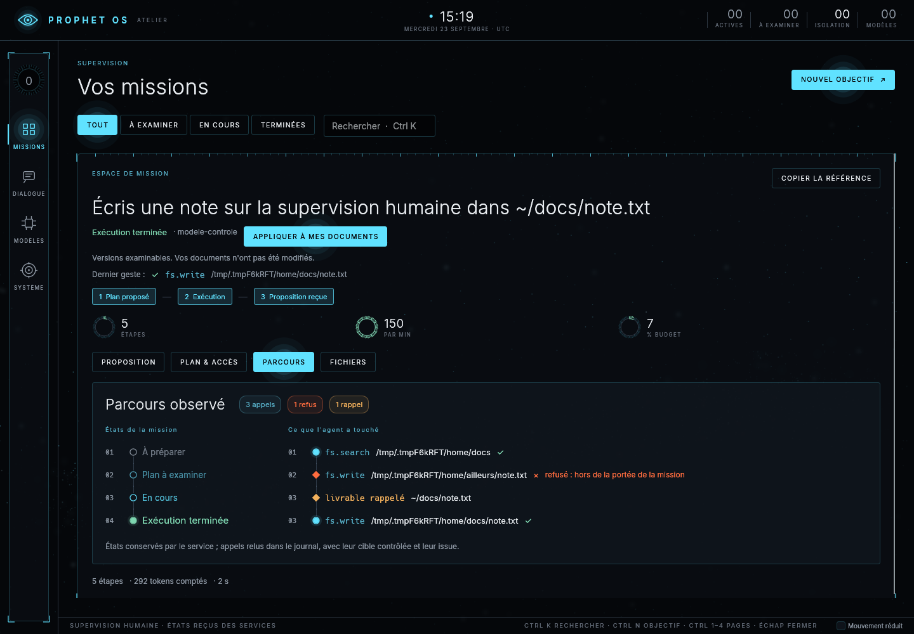
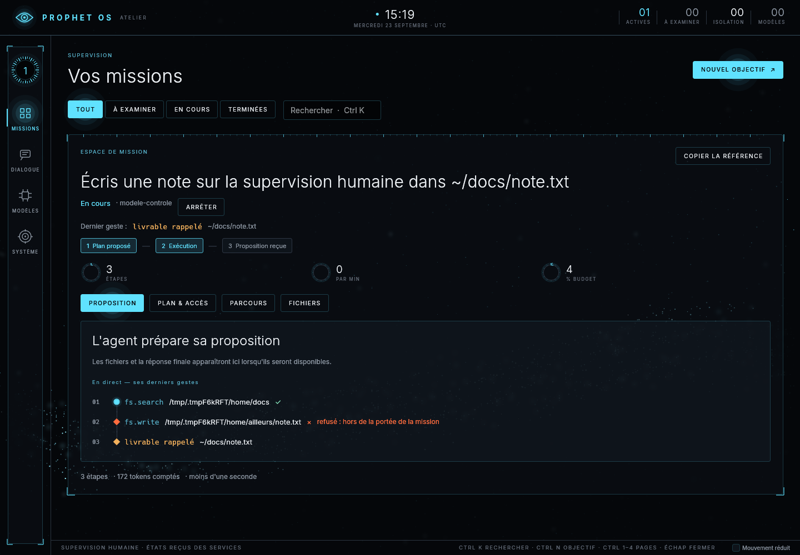
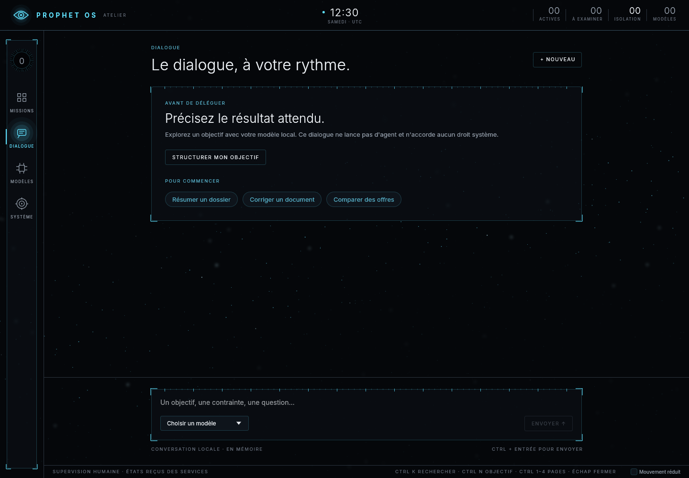

# Le parcours d'une mission en frise — 23 septembre 2026

Les couches que le banc M13 a ajoutées à la boucle d'agentd — le refus de chemin rendu au
modèle (ADR 0050), le livrable rappelé (ADR 0049), la note sur un échec répété (ADR 0052) —
changent ce qu'une mission *fait*. La surface devait le montrer : un humain qui supervise doit
voir qu'un accès a été refusé, que le service a rappelé un fichier, que l'agent s'est corrigé.

## Ce qui n'allait pas

- L'onglet Parcours n'était qu'une liste « 01 ✓ fs.write /chemin » ; le glyphe « ✕ » d'un
  échec manquait à la police embarquée et s'affichait en carré vide.
- Un refus de capd s'y lisait deux fois : l'appel échoué, puis une ligne « refus » à part.
- Rien ne distinguait un rappel du service d'un appel de l'agent.
- Pendant l'exécution, l'onglet Proposition disait seulement « L'agent prépare sa
  proposition ».
- Un dialogue vide n'offrait qu'un bouton au-dessus d'un grand vide.

## Ce qui a changé

- **Deux frises** : les états que le service a tenus, puis ce que l'agent a touché, un nœud par
  geste sur un rail. Plein à l'accent pour un appel réussi ; losange rouge pour un refus, rattaché
  à l'appel refusé, son motif en mots (« hors de la portée de la mission », « droits
  retirés ») ; losange orangé pour un livrable rappelé ; vert pour une publication. Des
  pastilles comptent en tête les appels, les refus et les rappels. Au-delà de 880 points, les
  deux frises se tiennent côte à côte ; en dessous, l'une sous l'autre.
- **En direct** : pendant l'exécution, l'onglet Proposition montre les cinq derniers gestes de
  l'agent, relus dans le journal, avec la même frise ; le « dernier geste » de l'en-tête prend
  les mêmes libellés.

- **Un dialogue vide propose trois départs** — résumer un dossier, corriger un document,
  comparer des offres — qui remplissent le brouillon sans rien envoyer.

Les chemins des captures sont absolus : l'essai tourne dans un répertoire personnel
temporaire, distinct de `$HOME`. Sur la machine, ils se lisent `~/…`.

## Vérification

| Élément | Où | Verdict |
|---|---|---|
| Refus rattaché à son appel, dans les deux ordres du journal | `cargo test -p surface --lib le_parcours` | vert |
| Mission réelle qui se trompe, est rappelée et se corrige ; frise et direct capturés à 640, 1440 et 1920 | `crates/surface/tests/missions.rs` (`needs_gpu`, lavapipe) | vert |
| Départs du dialogue : brouillon rempli, rien d'envoyé, focus sur la saisie | `crates/surface/tests/bureau.rs` (`needs_gpu`) | vert |

La CI rejoue ces essais dans le travail « Surface d'observation » et en publie les captures.
