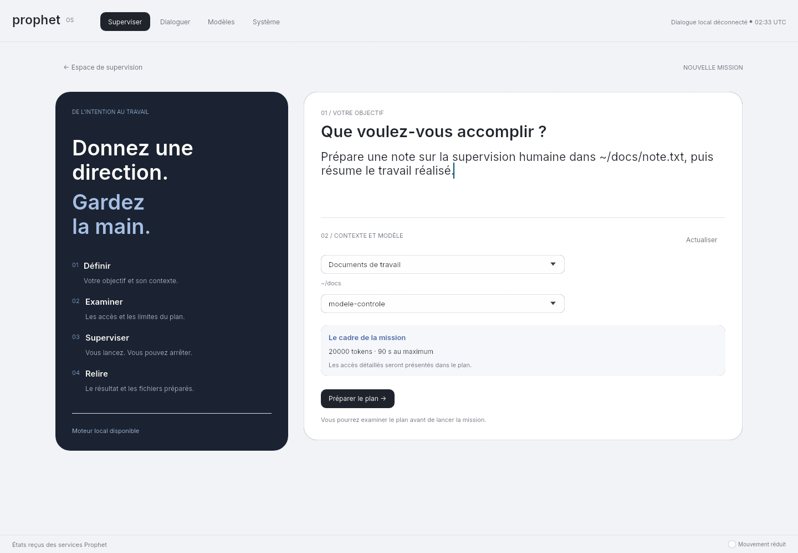
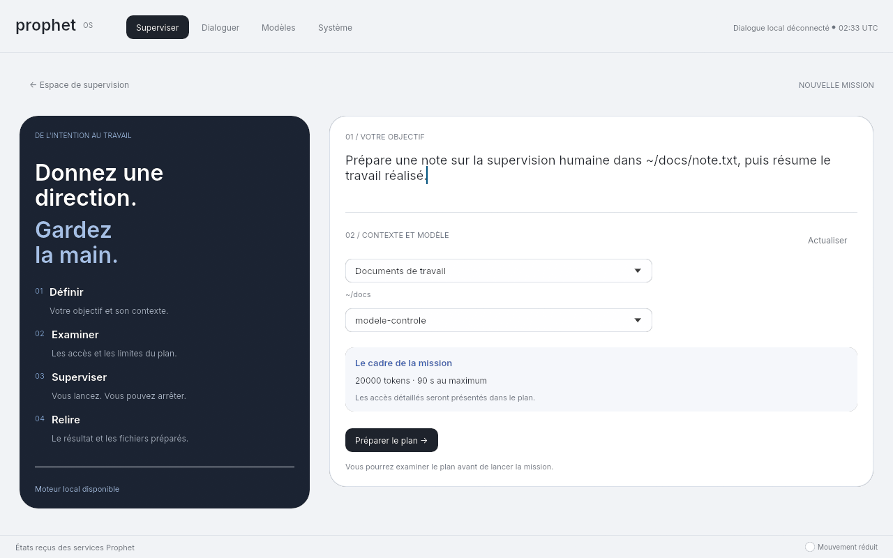
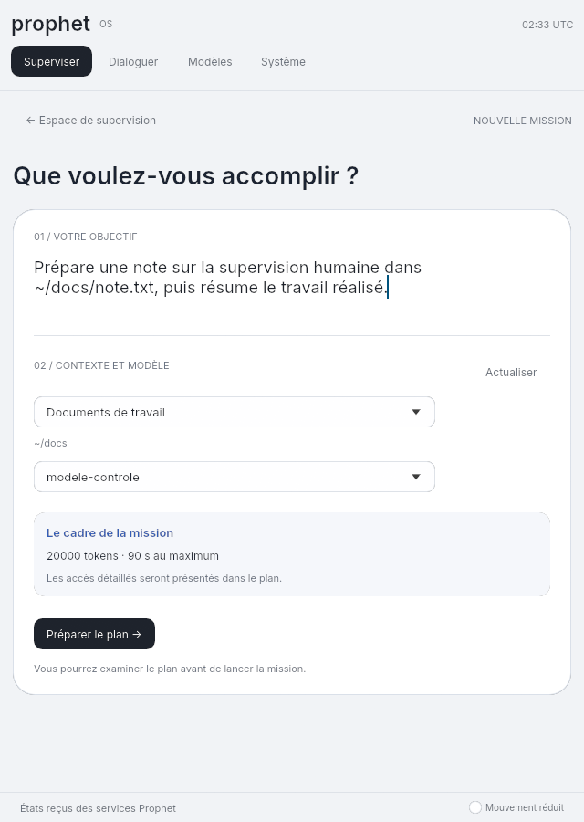
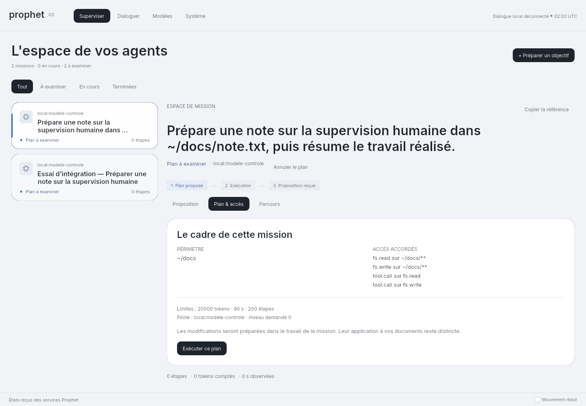
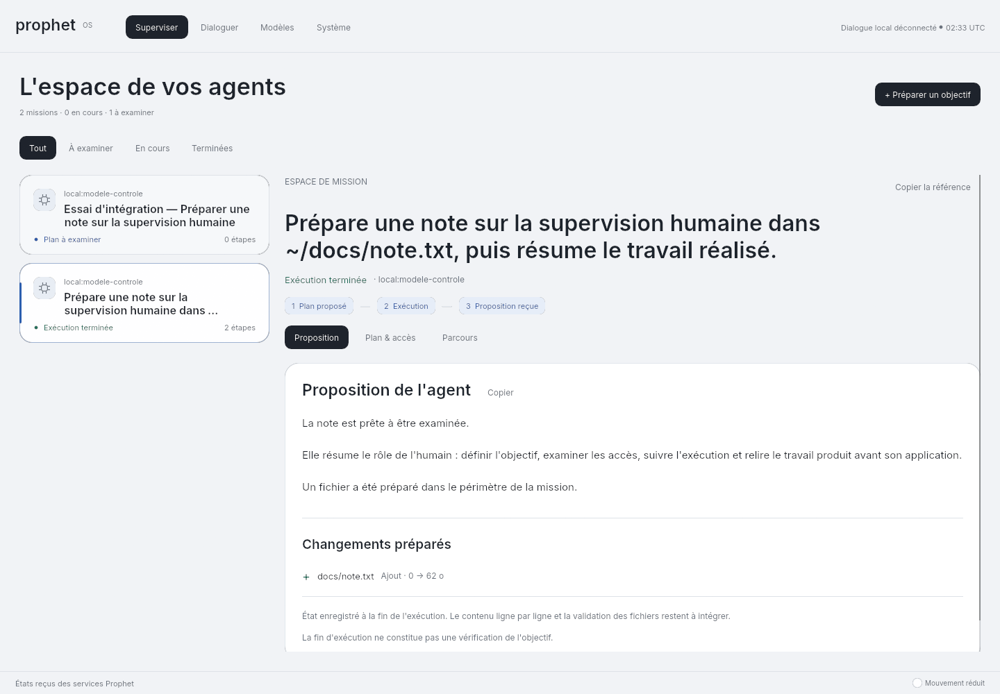

# De l'objectif saisi au plan de mission — 13 septembre 2026

La commande « Préparer un objectif » ouvre maintenant un formulaire de mission relié à agentd.
L'humain décrit le résultat attendu, choisit un contexte configuré et un modèle présent, puis
prépare le plan. L'interface sélectionne le plan confirmé pour permettre l'examen des accès
et le lancement explicite. La préparation ne lance ni génération ni outil.

Une demande du dialogue peut aussi devenir un brouillon. Seul le texte humain est repris :
la réponse du modèle ne choisit ni contexte ni droits. Les demandes, accès et limites sont
conservés dans le plan du service. Les brouillons restent pour l'instant en mémoire dans la surface.

## Contrat du service

Les profils viennent de `PROPHET_MISSION_PROFILES`, une configuration locale de confiance
limitée à 1 Mio et 32 profils. Le service valide leurs manifestes, modèles locaux et périmètres
avant d'ouvrir son socket. Les outils admissibles sont les outils fichiers natifs de niveau 0 ;
les droits d'écriture peuvent être plus étroits que le contexte lu. Les profils ne permettent
pas au formulaire de demander des processus, du réseau ou des droits globaux.

`task.options` fournit la vue des profils et interroge le moteur configuré dans agentd. Seuls
les modèles à la fois admis et effectivement découverts sont proposés. Ce moteur peut être
distinct du dialogue. `task.prepare` accepte seulement l'identifiant, l'intention, le profil
et le modèle. L'utilisateur provient de SO_PEERCRED. capd conserve son contrôle d'émission.

Le client garde une référence ULID et refuse un double envoi. Si la réponse disparaît,
« Retrouver le plan » utilise uniquement `task.inspect`. Un résultat dont l'identité,
l'objectif ou le modèle diffèrent est refusé. Aucun nouvel envoi automatique n'est utilisé.

## Rendu natif

La composition associe une colonne sombre décrivant les passages de responsabilité et un
formulaire clair centré sur l'objectif. Les fenêtres étroites présentent directement le
formulaire ; les fenêtres moins hautes utilisent une composition plus compacte. Les contrôles
restent des widgets natifs, avec saisie Unicode, presse-papiers et défilement.











Les captures du parcours utilisent un **modèle HTTP contrôlé**, avec agentd, capd et ledger
réels. Elles montrent le binaire natif ; elles ne démontrent pas la qualité d'un LLM réel.

## Vérification

Le premier test a échoué avec `MethodNotFound` sur `task.options`. Les tests du service
vérifient ensuite la découverte, les refus de paramètres et de profils, l'identité du pair,
l'absence d'inférence, la persistance du plan et le refus d'une référence déjà utilisée.
Le test de transport coupe la connexion après création et exige la séquence exacte
`task.options`, `task.prepare`, `task.inspect` pour retrouver le plan sans le recréer.

Le parcours graphique saisit une intention par le presse-papiers, vérifie les contrôles
visibles à 640, 1280 et 1440 pixels de large, prépare le plan puis clique pour le lancer.
Il vérifie le fichier produit dans le travail SFS et son absence dans les documents d'origine.
Après la fin de la mission, il reprend une nouvelle demande humaine du dialogue et vérifie
qu'elle ouvre un nouveau brouillon sans réutiliser la référence précédente. Le test de
navigation attend trois images après le changement de page et contrôle le focus avant
le collage ; cet ajustement synchronise le banc de test avec la mise en page native.
Un premier essai complet a dépassé le délai de confirmation de cinq secondes ; le même
binaire a ensuite réussi en exécution isolée, en 5,24 secondes pour l'ensemble du test.
La cause de ce délai n'est pas établie. Le test dédié à la perte de réponse vérifie le
comportement de récupération ; il ne prétend pas expliquer cette intermittence.

La validation finale réussit : **622 tests ordinaires, aucun échec, 25 ignorés**, avec
format, clippy, reconstruction des programmes et contrôles du dépôt. Les **15 tests
graphiques explicites réussissent**, après ajustement des petites hauteurs. Ils régénèrent
les douze captures de supervision et produisent les cinq captures de préparation ci-dessus.
Environnement : shell Nix, Rust 1.97.1, WSL2 Ubuntu 24.04, egui 0.36.2, wgpu 30 et
Mesa 26.2.2 avec rendu logiciel Vulkan.

```sh
nix develop --command just check
PROPHET_CAPTURE_DIR="$PWD/docs/images" nix develop --command \
  cargo test -p surface -- --ignored --test-threads=1 --nocapture
```

Sous WSL, `VK_DRIVER_FILES` désigne le fichier `lvp_icd.x86_64.json` de Mesa dans le store Nix.
La suite ne transforme pas l'absence d'adaptateur en réussite des tests graphiques.

## Limites

L'administrateur doit encore configurer les profils et démarrer le moteur. L'exemple de
profil est un fichier de développement avec une clé d'éditeur factice ; la vérification
cryptographique des manifestes n'est pas livrée. Le plan est le cadre d'exécution, pas une
décomposition du travail générée par IA. Le contrat historique de `task.spawn` et les droits
globaux du socket restent distincts du nouveau chemin de préparation.

Les trois échecs Qwen3-0.6B du parcours agentd restent ouverts. Aucun nouveau succès avec
un LLM réel n'est revendiqué. Le contenu des diffs, la validation du résultat et des fichiers,
les reprises, l'undo robuste, les processus isolés, le cycle de vie des modèles et l'intégration
à une session installée complète restent à réaliser. Les captures ne démontrent pas la
fluidité sur matériel physique ni une qualité visuelle comparable à Apple.

La CI du commit précédent `2eb86f8` a réussi les composants, l'isolation et la surface ;
son travail ChatGPT a échoué ([run 34731398933](https://github.com/speed25200-cyber/Prophet_OS/actions/runs/34731398933)).
Les sessions authentifiées ChatGPT/Claude Code restent à valider. Les exigences de
[FRONTIER](../FRONTIER.md) demeurent ouvertes. Voir l'[ADR 0015](../adr/0015-intention-et-profils-de-mission.md).
