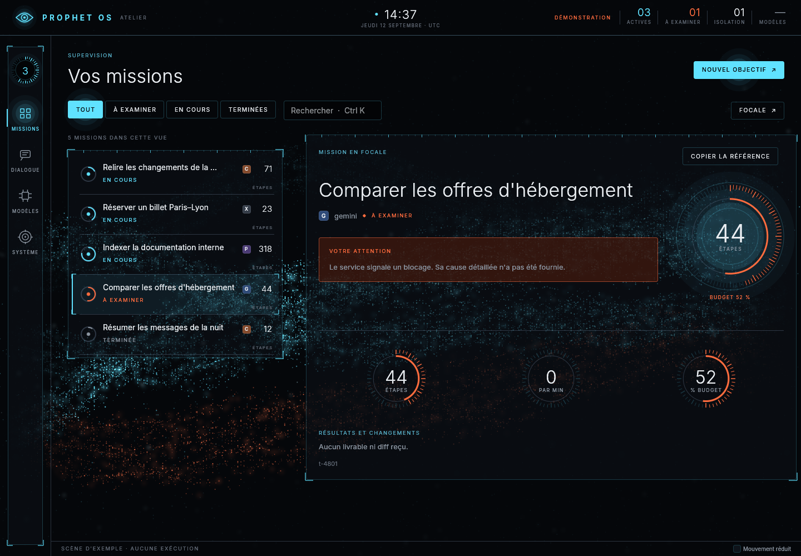
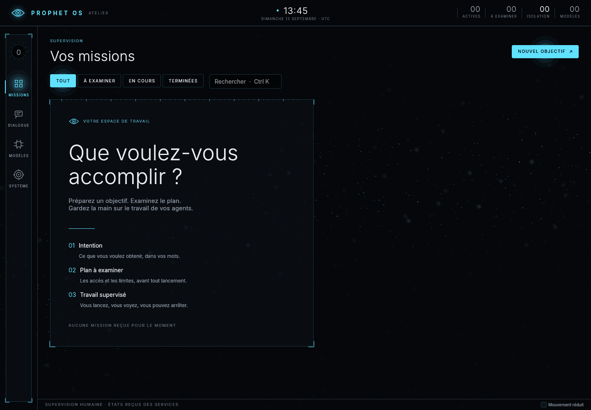

# Reprise, audit et seconde passe Réacteur — 22 septembre 2026

L'humain a demandé de reprendre le projet, de tout auditer et de viser un OS pour agents
visuellement abouti, fluide et optimisé. Cette session a fait trois choses : réunir le travail
dispersé sur plusieurs branches, vérifier l'arbre réuni, puis corriger et compléter l'atelier
Réacteur à partir de ce que ses captures montraient. L'[ADR 0043](../adr/0043-l-intention-d-abord-et-la-cadence-d-attention.md)
décrit les décisions d'interface.

Environnement : conteneur Ubuntu 24.04 à 4 cœurs, sans Nix ni KVM ni carte graphique ; rendu
par llvmpipe (Vulkan, lavapipe installé pour l'occasion). Rien ici ne mesure une carte
graphique réelle ni l'image installée.

## 1. Le travail réuni

`main` s'était arrêtée à `7d19592` (13 septembre). Sept branches en partaient ; deux portaient
du travail absent de toutes les autres :

| Branche | Commits propres | État | Décision |
|---|---|---|---|
| `codex/audit-wsl-20260913` | 150, jusqu'au 15 septembre | CI verte des deux côtés sur `adee017` | base de la reprise (avance rapide) |
| `claude/jev-prophet-os-integration-9viyyl` | 9, 17 et 18 septembre | CI rouge sur le seul contrôle Fontconfig de ChatGPT, déjà rouge sur `main` | fusionnée |
| `claude/prophet-os-audit-dev-cbu28z` | 3 non repris | — | `55491f0` repris ; les deux autres déjà couverts autrement (ADR 0035, test Mousepad) |
| `claude/optimistic-cray-pcd8oc`, `codex/prophet-runtime-local`, `claude/ai-optimized-os-design-djq7iw` | 0 non repris | — | déjà contenues |

La fusion de Jev a demandé cinq arbitrages, décrits dans le message de `d6e686f` : la
sélection garde la refonte `eligible` et la règle `client@palier` (ADR 0040) ; le compteur
commun de Jev garde le compte par modèle (ADR 0034) en imputant chaque tour à celui qui l'a
décidé ; une séance d'outils et une sous-mission n'ont pas le décideur rapide ; l'ADR de Jev
devient 0042 ; et le faux proxy du test Jev relaie désormais les pages, puisque le navigateur
piloté sort lui aussi par egress depuis l'ADR 0024. **Le test qui opère une page réelle par
Jev échouait sur l'arbre réuni pour cette dernière raison**, et c'est le test qui avait tort,
pas le code.

## 2. L'audit du code

| Contrôle | Résultat |
|---|---|
| `cargo fmt --all --check`, `cargo clippy --all-targets --all-features -- -D warnings` | réussis |
| `cargo test --workspace --no-fail-fast` après la fusion | **827 réussis, 0 échec, 43 ignorés** |
| `verifier-les-services`, `verifier-le-durcissement`, `verifier-la-doc-des-travaux` | réussis |
| Recherche de secrets de repli, sans gitleaks | **échouait** sur cinq fixtures d'essai et une ligne de rapport |

Le dernier point empêchait `just check` d'être vert sur toute machine sans gitleaks : la CI
n'analyse que la plage poussée, le repli local parcourait tout l'arbre. Les fixtures portent
désormais `gitleaks:allow`, la marque que gitleaks reconnaît, et le repli la respecte ; le
rapport Réacteur ne recopie plus la chaîne d'essai.

## 3. Ce que les captures montraient

Captures du binaire en build release, `--champ-complet`, avant toute modification :

- **La plaque de l'espace de mission débordait** de la colonne des commandes : 10 à 22 px
  selon la largeur, visible à 1440 px où sa marge droite faisait 8 px contre 40 à gauche. La
  rangée horizontale ajoutait l'espacement d'egui après la liste, puis après la colonne du
  titre, et la largeur ne le comptait pas.
- **« ÉTAPES »** touchait le trait qui sépare les lignes de mission et les crochets de la
  sélection.
- **L'écran vide posait une question sans champ pour y répondre**, et sa plaque était plus
  haute que l'écran une fois un champ ajouté.
- **Seule la recherche avait un raccourci.**
- **Le champ vivant ne ralentissait jamais** tant qu'une mission était active.

## 4. Ce qui change

- La plaque de mission s'arrête au bord des commandes, avec ou sans Focale ; le cadran garde
  sa place ; « ÉTAPES » se lit sous son nombre.
- L'écran vide reçoit l'objectif : Entrée ouvre la préparation avec l'objectif écrit, où l'on
  choisit contexte et modèle avant tout plan. Les trois étapes passent en colonnes et la
  plaque tient entière à 1440 × 1000.
- Ctrl 1 à 4 (pages), Ctrl N (nouvel objectif, champ aussitôt actif), Échap (refermer l'examen
  ou la préparation, après avoir rendu le focus d'un champ), rappelés dans la barre d'état.
- Après trente secondes sans geste, le champ passe à 20 images/s (10 en rendu logiciel) ; le
  premier geste rétablit la pleine cadence.
- `just captures` produit les noms `reacteur-*` que le rapport Réacteur cite ; `@echo` dans
  une recette shebang, qui aurait échoué, est corrigé.
- L'en-tête de l'inspecteur relié aux services dit le **dernier geste de l'agent** (outil,
  cible contrôlée, issue), relu dans le journal, et le donne à l'accessibilité ; une cible du
  dossier de l'humain s'écrit à partir de `~`. Les instruments compacts laissent leur valeur à
  droite de l'anneau au lieu de l'écrire à travers ses graduations.

Côté agents, les missions et les séances d'outils offrent désormais **`task.status` avec le
budget restant** et **`task.diff`** quand le profil les accorde : un agent sait ce qu'il lui
reste d'étapes, de tokens et de secondes, et ce qu'il a déjà modifié, au lieu de découvrir le
plafond en le heurtant. Les profils de l'image et des exemples les accordent.

## 5. Le crible des méthodes par classe de pair

Le compte de l'humain est membre de `prophet-system`, pour que sa session, la surface et la CLI
joignent les daemons ; sous son identité tournent aussi Claude Code, Codex et tout ce qu'il
lance. Un pair admis l'était pour toutes les méthodes. L'[ADR 0044](../adr/0044-les-methodes-reservees-par-classe-de-pair.md)
classe désormais chaque pair par son groupe principal — service pour les sept daemons, humain
pour les membres déclarés — et réserve :

| Daemon | Aux services | À l'humain |
|---|---|---|
| capd | `cap.mint`, `cap.delegate`, `cap.check`, `approval.request`, `approval.explain`, `approval.expire` | `approval.resolve` |
| ledger | `ledger.append`, `ledger.seal` | — |
| sandboxd | `sandbox.start`, `sandbox.run` | — |
| memoryd | `memory.remember` | — |

sandboxd était un détour réel : il lançait pour tout membre un programme sous sa propre identité,
de la classe des services, avec les montages et les sockets choisis par l'appelant. Et
`/run/prophet`, en `0770`, laissait tout membre supprimer `capd.sock` pour en poser un faux ; il
devient collant. Un daemon retirait aussi son socket avant d'en créer un nouveau, et le
retirait à l'arrêt : le nom de `capd.sock` était libre entre deux démarrages, assez pour qu'un
guet le trouve 125 371 fois en deux cents démarrages. Il est désormais posé par renommage et
reste en place à l'arrêt ; le guet ne le trouve plus libre. Restent ouverts, et dits dans
l'ADR : `task.spawn` d'agentd accepte un manifeste brut du compte de l'humain (c'est
`prophet task new`), et un processus de ce compte peut trancher une approbation comme l'humain.
L'essai NixOS des services vérifie les refus sous le vrai compte de l'humain.

## 5 bis. La fenêtre du moteur local

L'image sert ses modèles avec 4 096 tokens de fenêtre, et `fs.read` rend jusqu'à 256 Kio :
une seule lecture d'un fichier moyen faisait refuser l'historique par llama-server
(`exceed_context_size_error`) et la mission échouait sur « HTTP 400 » ; la conversation de
l'atelier, au bout d'une vingtaine d'échanges. Le pilote lit désormais ce refus — ses deux
nombres, jamais le reste —, resserre ce qui part au moteur à sa mesure et renvoie le tour :
résultats d'outils condensés puis tronqués avec un avis dans une mission, premiers messages
oubliés dans une conversation, qui le dit. Pour que l'agent n'ait pas à tout relire,
`fs.read` lit par morceaux (`offset`, `next_offset`, sans couper de caractère) et
`fs.search` rend les lignes trouvées, numéro et extrait. Complément de l'ADR 0034.

## 5 ter. Le 23 septembre : la réserve de microVM, Landlock, le cache du moteur

**M5-T4, la réserve de microVM (ADR 0045).** L'invité gagne un mode réserve : il démarre sans
tâche sur un disque d'attente et le dit ; sandboxd le met en pause, en fait un instantané, et
garde deux machines restaurées en pause. Une exécution de niveau 2 en prend une, lui confie le
disque de sa tâche et la reprend. Sur le coureur KVM de la CI : **une microVM rendue en 8,9 à
10,9 ms** (médiane de cinq prises, selon le passage) pour un objectif de 150 ms, une machine
restaurée en 6 ms, chaque prise sur une machine neuve, et cinq clones qui tirent cinq aléas
distincts. La page Système et `prophet status` disent l'état de la réserve.

**Landlock au niveau 0.** STATUS cochait « Landlock » depuis le 12 septembre ; l'amorçage ne
l'appliquait pas, et une sandbox pouvait créer des fichiers à sa propre racine. Il est appliqué :
rien ne se crée à la racine, rien ne s'écrit hors des chemins accordés, rien ne s'exécute hors
des montages en lecture seule. Les essais du niveau 0 se taisaient en CI faute d'espaces de
noms dans « check » ; le travail d'isolation les exige désormais, Landlock compris.

**Le cache du moteur local.** llama-server réévalue tout ce qui suit le premier message changé ;
condenser à chaque tour un résultat déjà envoyé le faisait réévaluer. Ne garder intact que le
dernier résultat réduit de 45 à 26 ko ce qu'une mission de huit lectures fait réévaluer.

**Erreurs et reprise.** « Relancer » dans l'inspecteur et `prophet task retry` repréparent une
mission échouée par le même contexte du catalogue ; un moteur injoignable se dit en français.
La fenêtre servie se lit dans `prophet model ls` et sur la page Modèles.

## 5 quater. Le 23 septembre, suite : l'instantané repris, les poids gérés

**L'instantané de la réserve survit au redémarrage.** Sous `/var/lib/prophet/sandboxd/reserve`,
sandboxd garde l'instantané de son invité en attente, avec l'empreinte de ce dont il dépend
(moniteur, noyau et racine d'invité, noyau et processeur de l'hôte) ; même empreinte, la
première machine est restaurée aussitôt. Sur le coureur KVM : **réserve reprise pleine en
7,4 ms**, contre 4,6 s pour un premier démarrage. `sandbox.run` et `proc.exec` disent à l'agent
ce que son exécution a coûté (`elapsed_ms`) et si la réserve a servi (`warm_start`).

**Les poids gérés (ADR 0046).** Un catalogue du système, compilé dans les binaires : adresse
épinglée, empreinte SHA-256 publiée, hôtes permis. `prophet model pull` et la page Modèles
demandent à agentd, qui télécharge par egress sous un jeton que capd émet pour les seuls hôtes
de l'entrée, refuse toute redirection hors d'eux, et ne pose le fichier qu'une fois taille,
empreinte et en-tête GGUF vérifiés ; une coupure reprend par `Range`, une empreinte fausse
efface. Le modèle que la configuration fournit déjà n'est pas retéléchargé. `model.list` dit
aux agents les poids locaux et leur fenêtre.

## 6. Vérifications

| Contrôle | Résultat local |
|---|---|
| Nouveau parcours `l_espace_de_mission_tient_dans_la_colonne_des_commandes` | **échouait** avant correction (11,6 px à 1280 × 720, puis 9,6 px pour le cadran) ; réussit à 1280, 1440 et 1920, avec et sans Focale |
| Nouveau parcours `l_espace_vide_recoit_l_objectif_et_ouvre_sa_preparation` | échouait avant (champ absent, puis plaque coupée) ; réussit à 1440 × 1000 et 640 × 900 |
| Nouveau parcours `le_clavier_ouvre_les_pages_et_la_preparation_sans_souris` | échouait avant ; réussit, y compris Échap en deux temps et brouillon conservé |
| `cargo test -p surface --test bureau --test rendu --test preparation --test branchement --test missions -- --include-ignored` | 14 + 6 + 1 + 2 + 5 réussis, aucun échec |
| `cargo test -p surface --lib` | 75 réussis (dont la cadence du champ), 1 ignoré (`needs_voice_stack`) |
| Nouveau parcours `l_agent_lit_son_budget_restant_et_ses_propres_changements` (vrais capd, ledger, agentd, modèle contrôlé) | échouait avant (« outil non proposé ») ; réussit : budget restant = plafond − consommé, diff de la note dans le travail |
| Catalogue des poids : cinq tests unitaires, `prophet model ls` sur un dossier synthétique, parcours GPU de la page Modèles | réussis |
| Tables d'accès de capd, ledger, sandboxd, memoryd et classification des pairs | tests unitaires réussis ; essai NixOS sous le compte de l'humain en CI |
| Refus de fenêtre : mission resserrée puis renvoyée, fenêtre apprise au tour suivant, intention démesurée rendue en erreur chiffrée, longue mission (quarante résultats), conversation qui oublie ses débuts | tests contre des serveurs qui rendent le refus exact de llama-server, **échouaient** avant (« HTTP 400 ») ; réussissent |
| `fs.read` par morceaux, `fs.search` par lignes | échouaient avant ; réussissent (morceaux recollés = texte exact, aucun caractère coupé) |
| Guet du nom de socket pendant 200 démarrages | vu libre **125 371 fois** avant ; jamais après |
| Réserve de microVM, coureur KVM de la CI | médiane de cinq prises 8,9 ms (`41def9e`), 10,9 ms (`4aaeb50`) ; restauration 6 ms ; cinq aléas distincts sur cinq clones |
| Landlock au niveau 0 | l'essai **échouait** avant (fichiers créés à la racine de la sandbox) ; réussit ici (ABI 7) et sur le coureur d'isolation |
| Condensation et cache du moteur | 26 ko à réévaluer au lieu de 45 ko sur une mission simulée de huit lectures de 3 ko |
| Instantané de la réserve repris, coureur KVM de la CI (`094a443`) | réserve pleine en 7,4 ms au second démarrage, 4,6 s au premier ; instantané refait après une empreinte altérée |
| Téléchargement vérifié des poids : sept essais unitaires (redirection, reprise, empreinte, en-tête, taille, refus du proxy, arrêt) et le parcours avec les vrais capd, ledger et egress | réussis ; le jeton ne sort jamais, une empreinte fausse ne pose rien |
| Page Modèles : catalogue, progression, clic vers un faux agentd | deux parcours de rendu réussis |
| `just check` | **883 réussis, 0 échec, 54 ignorés** ; format, clippy, contrôles du dépôt, secrets |

Mesures en rendu logiciel, 1920 × 1080, scène de démonstration (5 missions, 3 actives) :

| Mesure | Résultat |
|---|---|
| `--mesure 120`, champ allégé (12 000 particules) | médiane 13,50 ms, p95 15,62 ms, max 16,99 ms ; 154 Mio résidents |
| `--mesure 120 --champ-complet` (35 800 particules) | médiane 26,43 ms, p95 32,70 ms, max 53,02 ms ; 159 Mio |
| `--repos 10`, avant la cadence d'attention | 32,2 images/s, 117,7 % d'un cœur |
| `--repos 60`, après | 21,5 images/s en moyenne, 77,2 % d'un cœur ; environ 36 % une fois ralenti |
| `--repos 10 --mouvement-reduit` / sans mission | 0,3 image/s ; 2,8 % / 1,4 % d'un cœur |

## Limites

Aucune de ces mesures ne vaut pour une carte graphique : le rastériseur logiciel dessine sur
les mêmes cœurs que tout le reste. La qualité visuelle sur écran physique reste à apprécier
par l'utilisateur. Le premier appel réel de Jev reste ouvert (ADR 0042) ; cette session ne l'a
pas tenté, aucune clé n'y étant déposée. Rien n'a été vérifié sous Nix, en VM ou sur l'image
installée dans cette session : la CI de la branche le dira.
