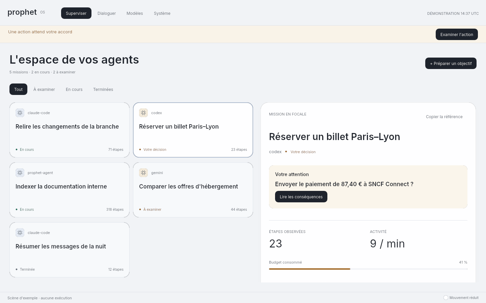
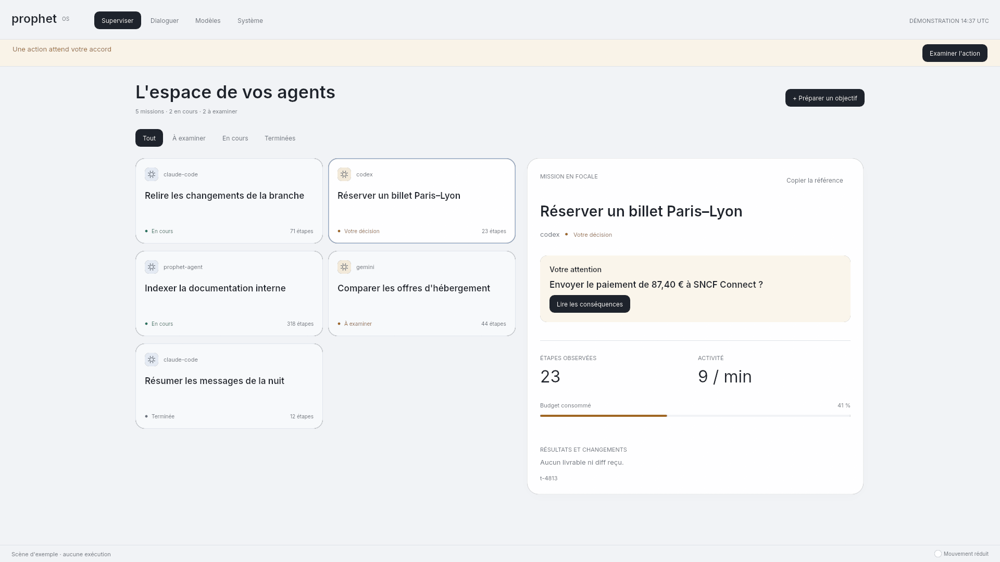
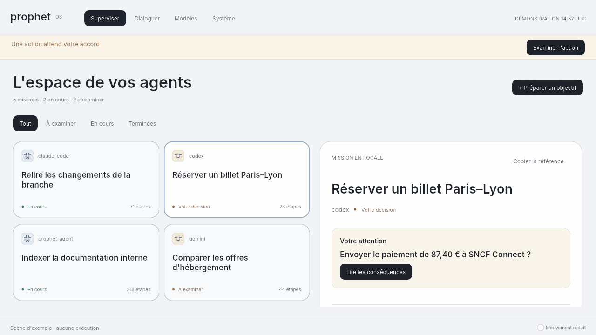
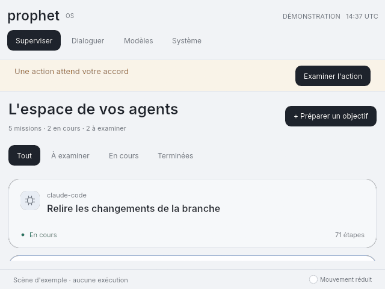
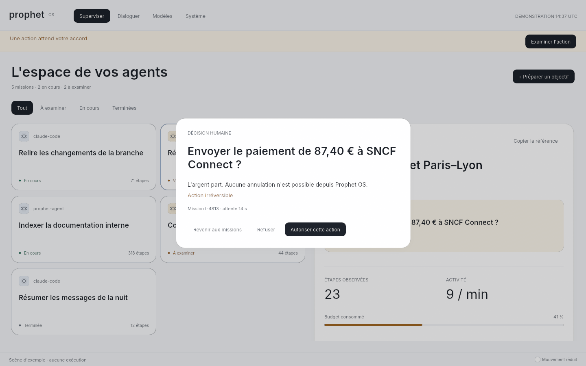
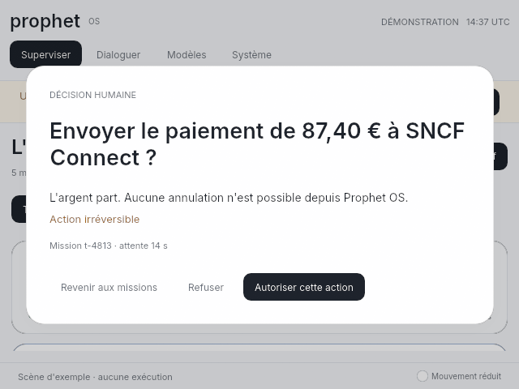
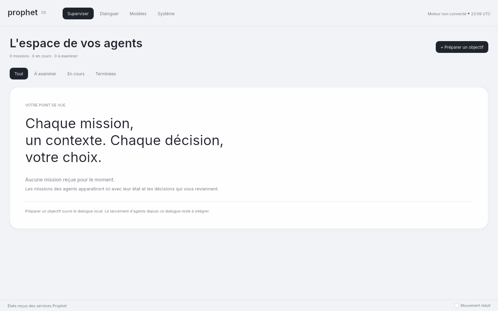
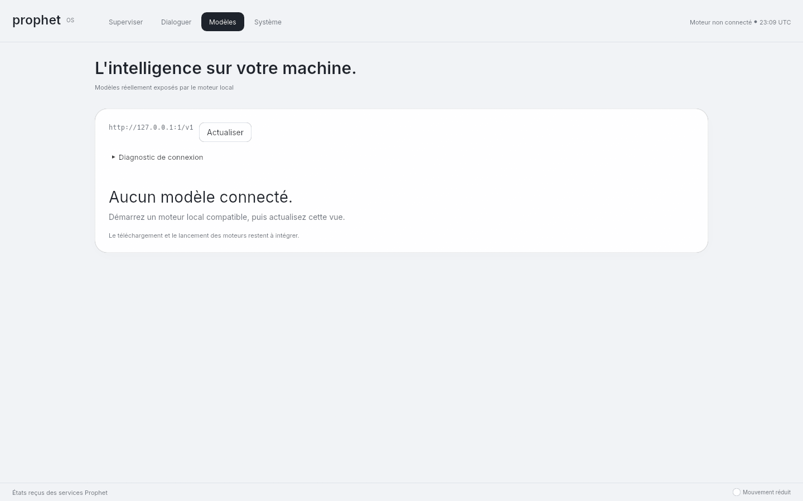
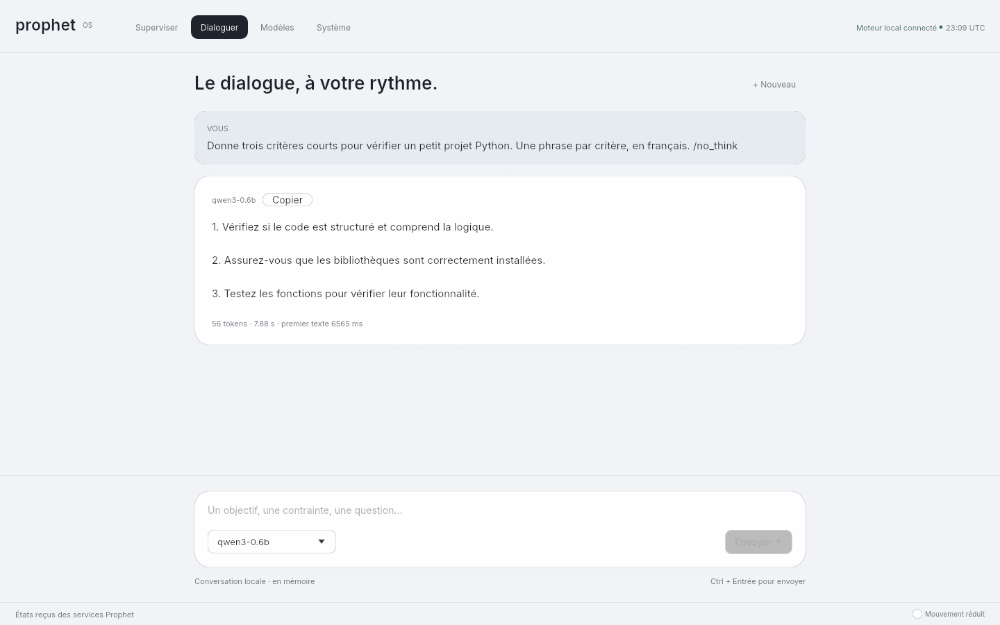

# Espace de supervision — 13 septembre 2026

Cette refonte remplace la direction Iris à la demande de l'utilisateur. L'accueil devient
l'espace des missions, avec contexte sélectionnable et examen des décisions. La conversation
locale devient un outil de préparation accessible depuis cette vue.

## Comportement livré

- Missions reçues des services, filtres Tout / À examiner / En cours / Terminées et inspecteur
  lié à l'identifiant de la mission. La sélection disparaît lorsque sa mission n'est plus reçue.
- Agent, état, étapes, activité et budget consommé affichés à partir de la scène. Le budget
  n'est pas présenté comme un pourcentage d'achèvement. Aucun livrable ni diff n'est inventé.
- Demande humaine prioritaire dans le contexte, bande d'attention accessible depuis toutes les
  pages et examen distinct. Ouvrir ou quitter l'examen ne répond pas à la demande.
- Retour aux missions sur petit écran. La sélection ouvre son contexte à la place de la liste.
- Suppression de la sculpture et des redessins de l'accueil toutes les 33 ms. Le thème est clair,
  Inter utilise explicitement une graisse 600 pour les titres, et les états conservent un libellé
  en plus de leur couleur. Le dessin reste natif, avec egui/wgpu.

## Captures du binaire

Les six premières captures montrent **une démonstration explicitement marquée**. Les agents,
missions et demandes sont des exemples ; ces vues ne prouvent aucune exécution authentifiée.













Les deux états suivants utilisent réellement une connexion absente. L'absence de mission
reçue n'est pas une preuve qu'aucun agent ne fonctionne ailleurs sur la machine.





Conversation avec llama.cpp et Qwen3-0.6B-Q8_0 sur CPU, texte du modèle conservé :



## Validation

Environnement : Ubuntu 24.04 sous WSL2, shell Nix du dépôt, Rust 1.97.1, egui 0.36.2,
wgpu 30, llvmpipe/Mesa 26.2.2.

- `just check` réussi : format, clippy, 577 tests réussis, aucun échec, 20 ignorés,
  contrôles des services, durcissement, documentation des travaux et recherche de secrets.
- Douze tests graphiques explicites réussis : six parcours du bureau natif et six tests
  conservés du rendu historique accessible par `--observation`.
- Neuf captures produites par le binaire final et relues : six scènes de démonstration,
  deux états sans connexion et une vraie réponse complète de Qwen local. Cet échange valide
  le fonctionnement du dialogue, pas la qualité du modèle ni ses performances comparées.

Les critères modifiés ont d'abord échoué sur Iris : entrée vers la préparation d'une mission,
visibilité des nouveaux contrôles et stabilité visuelle au repos. Les tests graphiques
exercent ensuite la sélection, les filtres, la disparition d'une mission, le presse-papiers,
la navigation, la saisie Unicode, le collage et le contexte à petite taille. L'examen est
vérifié à trois tailles : aucun accord à l'ouverture, choix visibles, refus explicite et
fermeture de l'examen quand la conséquence change.

```sh
nix develop --command just check
nix develop --command cargo test -p surface -- --ignored --test-threads=1
nix develop --command cargo run -p surface --bin prophet-surface -- \
  --capture supervision.png --largeur 1440 --hauteur 900 --demonstration --decision
nix develop --command cargo run -p surface --bin prophet-surface -- \
  --capture examen.png --largeur 640 --hauteur 480 --demonstration --decision --examen
```

`--examen` est réservé à une capture de décision de démonstration. Il active le contrôle
d'ouverture de l'examen ; il ne clique ni sur l'autorisation ni sur le refus.

## Limites

Cette évolution rend la supervision consultable et les décisions examinables. Elle ne livre
pas encore la chaîne complète objectif → agent → outils → livrables vérifiés. Le lancement,
la pause des agents depuis cette vue, les diffs, les droits détaillés, les journaux d'actions et
la persistance restent à intégrer. La conversation est en mémoire et son Markdown reste du
texte brut. Le contrat d'approbation conserve ses limites préexistantes : identité de la
demande à exposer dans la scène, acquittement et erreurs à afficher dans l'interface.

La fluidité, le coût au repos et l'accessibilité par un lecteur d'écran sur matériel physique
ne sont pas mesurés ici. Les tests ne démontrent ni une qualité équivalente à Apple ni un OS
SOTA. Les blocages du bureau installé et de ChatGPT restent ceux de [STATUS.md](../STATUS.md).
